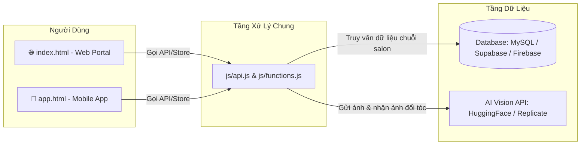

# 📘 CẨM NANG HƯỚNG DẪN TOÀN TẬP: VẬN HÀNH WEB, BUILD APP MOBILE & KẾT NỐI DATABASE CHUỖI SALON

> **Dự án**: OmniSalon / 4RAU Barbershop Enterprise Suite  
> **Kiến trúc**: 1 Cơ sở dữ liệu dùng chung — Tách biệt 2 nền tảng Web Portal (`index.html`) & Mobile App Android/iOS (`app.html`)  
> **Công nghệ**: HTML5, Vanilla Modern CSS/JS, Capacitor CLI (Native Android/iOS), AI Restyle Vision API, MySQL/PostgreSQL/Supabase.

---

## 📑 MỤC LỤC
1. [Khởi Chạy & Trải Nghiệm Dự Án Trên Máy Tính (Localhost)](#1-khởi-chạy--trải-nghiệm-dự-án-trên-máy-tính-localhost)
2. [Cấu Trúc Tách Riêng Web & Mobile App (Chung 1 Database)](#2-cấu-trúc-tách-riêng-web--mobile-app-chung-1-database)
3. [Hướng Dẫn Kết Nối Cơ Sở Dữ Liệu Thật (Database & Backend)](#3-hướng-dẫn-kết-nối-cơ-sở-dữ-liệu-thật-database--backend)
4. [Hướng Dẫn Cấu Hình API Đổi Tóc AI Bằng Ảnh Thật (AI Photo Restyle)](#4-hướng-dẫn-cấu-hình-api-đổi-tóc-ai-bằng-ảnh-thật-ai-photo-restyle)
5. [Hướng Dẫn Đóng Gói (Build) Thành Ứng Dụng Mobile APK Thật Bằng Capacitor](#5-hướng-dẫn-đóng-gói-build-thành-ứng-dụng-mobile-apk-thật-bằng-capacitor)
6. [Hướng Dẫn Triển Khai (Upload) Lên Hosting / VPS / Cloud](#6-hướng-dẫn-triển-khai-upload-lên-hosting--vps--cloud)

---

## 1. Khởi Chạy & Trải Nghiệm Dự Án Trên Máy Tính (Localhost)

Hiện tại dự án được xây dựng theo chuẩn Web hiện đại, không cần cấu hình phức tạp, bạn có thể chạy ngay bằng bất kỳ Web Server mini nào.

### Cách 1: Dùng Python (Có sẵn trên hầu hết máy tính)
Mở Terminal / PowerShell tại thư mục `d:\OmniSalon` và chạy:
```powershell
python -m http.server 5500
```
- Truy cập **Bản Web (Dành cho máy tính & trình duyệt web)**:
  👉 **`http://localhost:5500/index.html`** hoặc **`http://localhost:5500`**
- Truy cập **Bản Mobile App (Giao diện chuẩn di động)**:
  👉 **`http://localhost:5500/app.html`**

### Cách 2: Dùng Node.js (`npx serve` hoặc `live-server`)
```powershell
npx serve -l 5500
```

### Cách 3: Dùng Extension "Live Server" trong VS Code
Chỉ cần nhấp chuột phải vào `index.html` hoặc `app.html` và chọn **"Open with Live Server"**.

---

## 2. Cấu Trúc Tách Riêng Web & Mobile App (Chung 1 Database)

Dự án đã được phân tách thành 2 ứng dụng độc lập nhưng chia sẻ cùng một "bộ não" (Data Store & API Layer):

```text
d:\OmniSalon\
├── index.html              # 🌐 Giao diện Web Portal (Desktop, Laptop, Tablet, Responsive)
├── app.html                # 📱 Giao diện Mobile App (Được tối ưu cho Android & iOS)
├── capacitor.config.json   # ⚙️ Cấu hình đóng gói ứng dụng native bằng Capacitor
├── package.json            # 📦 Khai báo dependencies cho Node.js & Capacitor CLI
├── database_schema.sql     # 🗄️ Bản thiết kế cơ sở dữ liệu quan hệ cho chuỗi salon
├── styles.css              # 🎨 Design tokens, Glassmorphism, Micro-animations, Before/After Slider
└── js/
    ├── api.js              # 🔌 Tầng kết nối API trung tâm (Web & App đều gọi qua đây)
    ├── functions.js        # 🧠 Reactive State Store, nghiệp vụ đặt lịch, chuỗi chi nhánh, giỏ hàng
    ├── ui-common.js        # 🧩 Component chung: AI Photo Restyle Modal, Booking Wizard, Auth, Cart
    └── ui-platforms.js     # 🖥️ Render giao diện riêng: UIWeb (Web Portal) & UIApp (Mobile App)
```

### Luồng Dữ Liệu Đồng Bộ:


---

## 3. Hướng Dẫn Kết Nối Cơ Sở Dữ Liệu Thật (Database & Backend)

### Bước 1: Khởi tạo Database với file `database_schema.sql`
Trong thư mục dự án đã tạo sẵn file [database_schema.sql](file:///d:/OmniSalon/database_schema.sql). File này chứa đầy đủ các bảng dữ liệu chuẩn cho chuỗi salon:
- `branches`: Danh sách 18+ chi nhánh (địa chỉ, số điện thoại, số ghế, quản lý).
- `services`: Danh sách dịch vụ (cắt, uốn con sâu, ép side, nhuộm, tẩy...).
- `stylists` & `shifts`: Danh sách thợ cắt tóc theo từng chi nhánh và ca làm việc.
- `bookings`: Lịch hẹn đặt trước (ngày, giờ, thợ, dịch vụ, trạng thái).
- `products`: Sản phẩm pomade, sáp vuốt tóc Brosh, dầu gội xả.
- `orders`: Đơn mua hàng từ giỏ hàng.
- `users`: Tài khoản khách hàng & quản trị viên salon.
- `ai_history`: Lịch sử ảnh đổi kiểu tóc của khách hàng.

**Cách import vào MySQL / phpMyAdmin:**
1. Mở phpMyAdmin hoặc MySQL Workbench.
2. Tạo database mới tên: `omnisalon_db`.
3. Chọn tab **Import** (Nhập), chọn file `database_schema.sql` và bấm **Go** (Thực hiện).

### Bước 2: Dựng Backend API (Node.js / Express mẫu)
Bạn có thể tạo một server Node.js nhanh để kết nối Frontend với MySQL:
```javascript
// server.js (Node.js + Express + mysql2)
const express = require('express');
const cors = require('cors');
const mysql = require('mysql2/promise');

const app = express();
app.use(cors());
app.use(express.json({ limit: '20mb' }));

const pool = mysql.createPool({
  host: 'localhost',
  user: 'root',
  password: 'your_password',
  database: 'omnisalon_db'
});

// 1. Lấy danh sách chi nhánh
app.get('/api/branches', async (req, res) => {
  const [rows] = await pool.query('SELECT * FROM branches');
  res.json(rows);
});

// 2. Tạo lịch hẹn mới
app.post('/api/bookings', async (req, res) => {
  const { branchId, stylistId, customerName, phone, serviceId, bookingDate, bookingTime } = req.body;
  const [result] = await pool.query(
    'INSERT INTO bookings (branch_id, stylist_id, customer_name, phone, service_id, booking_date, booking_time) VALUES (?, ?, ?, ?, ?, ?, ?)',
    [branchId, stylistId, customerName, phone, serviceId, bookingDate, bookingTime]
  );
  res.json({ success: true, bookingId: result.insertId });
});

app.listen(3000, () => console.log('Backend API running on port 3000'));
```

### Bước 3: Đổi cấu hình kết nối trong `js/api.js`
Mở file `js/api.js` và cập nhật biến `API_BASE_URL`:
```javascript
// js/api.js
const API_CONFIG = {
  // Thay đổi thành URL server backend của bạn khi triển khai thật
  BASE_URL: 'https://api.yourdomain.com/api', // hoặc 'http://localhost:3000/api'
  USE_LIVE_API: true // Đổi thành true để chuyển từ localStorage sang Database thật
};
```

---

## 4. Hướng Dẫn Cấu Hình API Đổi Tóc AI Bằng Ảnh Thật (AI Photo Restyle)

Tính năng **AI Photo Restyle** cho phép khách hàng chụp selfie hoặc tải ảnh chân dung lên, chọn kiểu tóc mong muốn (Side Part 7/3, Undercut, Mullet, Uốn Con Sâu, Nhuộm Khói...), hệ thống gửi ảnh đến API trí tuệ nhân tạo và trả về bức ảnh khuôn mặt khách hàng với mái tóc mới.

### Cách thức hoạt động:
1. **Chế độ Demo Tức Thì (Có sẵn)**: Không cần cài đặt bất kỳ API key nào, hệ thống đã tích hợp sẵn bộ lọc AI thông minh tạo hiệu ứng đổi kiểu tóc và cho phép kiểm tra ngay lập tức tính năng Trước/Sau (Before/After Slider).
2. **Chế độ Kết Nối AI Cloud Thật**:
   - **Hugging Face Inference API (Miễn phí)**:
     1. Truy cập `https://huggingface.co/settings/tokens`.
     2. Tạo Access Token miễn phí (quyền `read`).
     3. Sử dụng model Face-to-Many hoặc Stable Diffusion Inpainting.
   - **Replicate API**:
     1. Đăng ký tại `https://replicate.com/` và lấy API Token.
     2. Sử dụng model `tencentarc/photomaker` hoặc `fofr/face-to-many`.
   - **OpenAI DALL-E 3 / Custom Webhook**:
     Nhập API Key trong giao diện **Cài Đặt API** ngay bên trong Modal AI Studio của web/app.

---

## 5. Hướng Dẫn Đóng Gói (Build) Thành Ứng Dụng Mobile APK Thật Bằng Capacitor

Dự án đã được thiết lập sẵn file `capacitor.config.json`. Bạn có thể dễ dàng build thành ứng dụng **Android (file .apk)** và **iOS** thật để cài đặt trực tiếp lên điện thoại hoặc đưa lên Google Play Store.

### Bước chuẩn bị:
1. Cài đặt **Node.js** (tải tại [nodejs.org](https://nodejs.org/)).
2. Cài đặt **Android Studio** (tải tại [developer.android.com/studio](https://developer.android.com/studio)).

### Các bước đóng gói ứng dụng:

Mở Terminal tại thư mục `d:\OmniSalon`:

```powershell
# 1. Cài đặt các thư viện đóng gói Capacitor
npm install

# 2. Khởi tạo nền tảng Android (chỉ cần chạy 1 lần đầu tiên)
npx cap add android

# 3. Đồng bộ mã nguồn giao diện Mobile (app.html) vào ứng dụng Android
npx cap sync

# 4. Mở dự án trong Android Studio để xuất file APK
npx cap open android
```

### Xuất file APK trong Android Studio:
1. Khi Android Studio mở ra, đợi Gradle tải xong tài nguyên (khoảng 1 - 2 phút).
2. Chọn menu trên cùng: **Build** ➜ **Build Bundle(s) / APK(s)** ➜ **Build APK(s)**.
3. Khi hoàn tất, một thông báo xuất hiện ở góc phải dưới: Nhấn vào **locate** để lấy file `app-debug.apk`.
4. Copy file `app-debug.apk` vào điện thoại Android của bạn và bấm Cài Đặt (Install).

---

## 6. Hướng Dẫn Triển Khai (Upload) Lên Hosting / VPS / Cloud

### Phương án 1: Triển khai lên Vercel / Netlify (Nhanh nhất, Miễn phí, Có HTTPS)
1. Cài đặt Vercel CLI:
   ```powershell
   npm i -g vercel
   ```
2. Chạy lệnh:
   ```powershell
   vercel
   ```
3. Nhấn `Enter` để xác nhận các tùy chọn mặc định. Dự án sẽ có ngay một tên miền dạng: `https://omnisalon-barbershop.vercel.app` hoạt động toàn cầu.

### Phương án 2: Triển khai lên Hosting cPanel thông thường
1. Nén toàn bộ thư mục `OmniSalon` thành file `.zip`.
2. Đăng nhập vào cPanel ➜ Chọn **File Manager** (Quản lý tệp).
3. Đi vào thư mục `public_html/`.
4. Bấm **Upload** và tải file `.zip` lên.
5. Nhấp chuột phải vào file `.zip` vừa tải lên và chọn **Extract** (Giải nén).
6. Truy cập tên miền của bạn (ví dụ: `https://yourdomain.com`).
   - Web Portal: `https://yourdomain.com/`
   - Mobile App Web: `https://yourdomain.com/app.html`

### Phương án 3: Triển khai lên VPS Linux (Nginx)
Cấu hình mẫu cho Nginx (`/etc/nginx/sites-available/omnisalon`):
```nginx
server {
    listen 80;
    server_name yourdomain.com;
    root /var/www/omnisalon;
    index index.html;

    location / {
        try_files $uri $uri/ /index.html;
    }

    location /app {
        try_files $uri /app.html;
    }

    # Bật nén gzip tăng tốc độ tải trang
    gzip on;
    gzip_types text/plain text/css application/json application/javascript text/xml application/xml;
}
```

---

## 📞 Hỗ Trợ & Mở Rộng
Toàn bộ mã nguồn được thiết kế theo mô hình module hóa cao:
- Muốn chỉnh sửa menu Web: Vào `js/ui-platforms.js` ➜ `UIWeb`.
- Muốn chỉnh sửa menu App: Vào `js/ui-platforms.js` ➜ `UIApp` hoặc `app.html`.
- Muốn chỉnh sửa logic đặt lịch / giỏ hàng: Vào `js/functions.js`.
- Muốn sửa giao diện AI / Modal: Vào `js/ui-common.js`.
