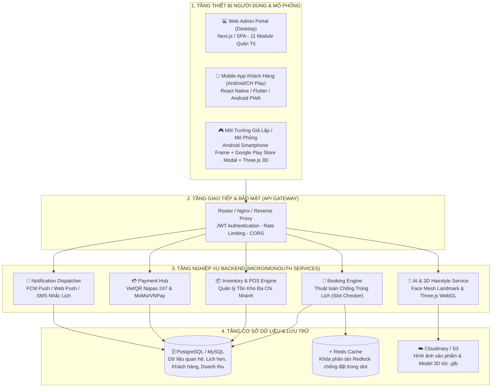

# KẾ HOẠCH XÂY DỰNG TOÀN DIỆN DỰ ÁN HỆ THỐNG SALON TÓC
## Đề Tài: Xây Dựng Ứng Dụng Hỗ Trợ Đặt Lịch & Bán Sản Phẩm Chăm Sóc Tóc Tại Salon Tóc
### Mã đề tài: **CNTT-KLCN039** | Đơn vị: Trường Đại học Công Thương TP.HCM (HUIT)
**Giảng viên hướng dẫn:** ThS. Đinh Thị Tám (`tamdt@huit.edu.vn`)  
**Thời gian thực hiện:** 2026 — 2027  
**Kiến trúc triển khai:** Web Portal Quản Trị + Mobile App Khách Hàng (CH Play) + Backend API + Môi Trường Mô Phỏng Tương Tác

---

## 📑 MỤC LỤC

1. [TỔNG QUAN ĐỀ TÀI & CĂN CỨ NGHIỆP VỤ](#1-tổng-quan-đề-tài--căn-cứ-nghiệp-vụ)
2. [KIẾN TRÚC TỔNG THỂ HỆ THỐNG (SYSTEM ARCHITECTURE)](#2-kiến-trúc-tổng-thể-hệ-thống-system-architecture)
3. [KẾ HOẠCH TRIỂN KHAI TỪNG BƯỚC (ROADMAP 8 GIAI ĐOẠN)](#3-kế-hoạch-triển-khai-từng-bước-roadmap-8-giai-đoạn)
   - [Giai Đoạn 1: Khảo sát, phân tích nghiệp vụ & lập đặc tả SRS](#giai-đoạn-1-khảo-sát-phân-tích-nghiệp-vụ--lập-đặc-tả-srs)
   - [Giai Đoạn 2: Thiết kế Cơ sở dữ liệu (ERD) & Đặc tả Backend API](#giai-đoạn-2-thiết-kế-cơ-sở-dữ-liệu-erd--đặc-tả-backend-api)
   - [Giai Đoạn 3: Xây dựng Backend Core & Thuật toán chống trùng lịch](#giai-đoạn-3-xây-dựng-backend-core--thuật-toán-chống-trùng-lịch)
   - [Giai Đoạn 4: Xây dựng Nền tảng Web Quản Trị Salon (Web Admin)](#giai-đoạn-4-xây-dựng-nền-tảng-web-quản-trị-salon-web-admin)
   - [Giai Đoạn 5: Xây dựng Nền tảng Mobile App Khách Hàng (Android/CH Play)](#giai-đoạn-5-xây-dựng-nền-tảng-mobile-app-khách-hàng-androidch-play)
   - [Giai Đoạn 6: Xây dựng Module Mô Phỏng Thực Tế & Thử Tóc AI 3D](#giai-đoạn-6-xây-dựng-module-mô-phỏng-thực-tế--thử-tóc-ai-3d)
   - [Giai Đoạn 7: Tích hợp Thanh toán số (VietQR) & Thông báo tự động](#giai-đoạn-7-tích-hợp-thanh-toán-số-vietqr--thông-báo-tự-động)
   - [Giai Đoạn 8: Kiểm thử hệ thống, Viết khóa luận & Đóng gói triển khai](#giai-đoạn-8-kiểm-thử-hệ-thống-viết-khóa-luận--đóng-gói-triển-khai)
4. [THIẾT KẾ CƠ SỞ DỮ LIỆU CHI TIẾT (DATABASE SCHEMA)](#4-thiết-kế-cơ-sở-dữ-liệu-chi-tiết-database-schema)
5. [ĐẶC TẢ GIAO DIỆN LẬP TRÌNH API (RESTFUL APIS)](#5-đặc-tả-giao-diện-lập-trình-api-restful-apis)
6. [HỆ THỐNG MÔ PHỎNG & TRÌNH DIỄN DEMO CHO HỘI ĐỒNG BẢO VỆ](#6-hệ-thống-mô-phỏng--trình-diễn-demo-cho-hội-đồng-bảo-vệ)

---

## 1. TỔNG QUAN ĐỀ TÀI & CĂN CỨ NGHIỆP VỤ

Theo văn bản giao đề tài **CNTT-KLCN039**, mục tiêu và yêu cầu nghiệp vụ được quy định như sau:

### 1.1. Mục tiêu
- Xây dựng ứng dụng cho salon tóc tích hợp **đặt lịch** và **bán sản phẩm chăm sóc tóc**.
- Giúp khách hàng đặt dịch vụ thuận tiện, nhanh chóng, không mất thời gian chờ đợi.
- Giúp salon quản lý toàn diện lịch hẹn, nhân viên, ca làm, sản phẩm, số lượng tồn kho và doanh thu.

### 1.2. Yêu cầu nghiệp vụ chi tiết
1. **Quản lý vận hành salon:** Dịch vụ, bảng giá (riêng lẻ & combo), nhân viên (Stylist/Barber), phân ca làm việc, quản lý lịch hẹn theo thời gian thực.
2. **Quản lý khách hàng & thương mại:** Khách hàng (CRM), sản phẩm chăm sóc tóc, định mức tồn kho chi nhánh, đơn bán hàng tại quầy (POS) & online, voucher khuyến mãi.
3. **Báo cáo & thống kê:** Báo cáo doanh thu theo ngày/tháng/chi nhánh, mật độ lịch hẹn, dịch vụ phổ biến nhất, sản phẩm bán chạy nhất và đánh giá hiệu suất làm việc của từng nhân viên.
4. **Xử lý thanh toán & thông báo:** Thanh toán không tiền mặt (VietQR/Cổng thanh toán), gửi thông báo xác nhận lịch hẹn và nhắc hẹn tự động trước giờ phục vụ.
5. **Trải nghiệm khách hàng:** Xem danh mục dịch vụ, bảng giá, mẫu tóc nam/nữ; chọn nhân viên ưa thích, ngày thực hiện và khung giờ còn trống (Slot); đặt lịch, thay đổi giờ hẹn hoặc hủy lịch; theo dõi trạng thái và đánh giá chất lượng (Rating/Review).

### 1.3. Yêu cầu triển khai 3 trụ cột
- **Nền tảng Web (Admin Portal & Storefront):** Phục vụ quản trị viên, nhân viên thu ngân và khách hàng máy tính.
- **Nền tảng Mobile App (Android / CH Play & iOS):** Phục vụ trải nghiệm người dùng di động cá nhân hóa, nhận thông báo đẩy.
- **Backend API & Core Engine:** Đồng bộ dữ liệu tập trung, kiểm tra slot trống chống trùng lịch 100%, bảo mật giao dịch và quản lý kho.

---

## 2. KIẾN TRÚC TỔNG THỂ HỆ THỐNG (SYSTEM ARCHITECTURE)

Hệ thống được thiết kế theo mô hình kiến trúc phân lớp hiện đại (Clean Architecture / Multi-Tier), tích hợp module mô phỏng:



---

## 3. KẾ HOẠCH TRIỂN KHAI TỪNG BƯỚC (ROADMAP 8 GIAI ĐOẠN)

Dưới đây là kế hoạch chi tiết từng bước (Step-by-Step Milestones) giúp bạn hình dung toàn bộ quá trình phát triển từ lúc nhận đề tài đến lúc bảo vệ luận văn:

```
[Giai đoạn 1] Khảo sát nghiệp vụ & Đặc tả SRS (Tuần 1 - 2)
      │
      ▼
[Giai đoạn 2] Thiết kế Cơ sở dữ liệu ERD & Đặc tả API (Tuần 3 - 4)
      │
      ▼
[Giai đoạn 3] Xây dựng Backend Core & Thuật toán chống trùng lịch (Tuần 5 - 6)
      │
      ▼
[Giai đoạn 4] Xây dựng Web Quản Trị Salon Admin (Tuần 7 - 8)
      │
      ▼
[Giai đoạn 5] Xây dựng Mobile App Khách Hàng Android CH Play (Tuần 9 - 10)
      │
      ▼
[Giai đoạn 6] Xây dựng Module Mô Phỏng Thực Tế & Thử Tóc 3D AI (Tuần 11 - 12)
      │
      ▼
[Giai đoạn 7] Tích hợp Thanh toán VietQR & Thông báo tự động (Tuần 13)
      │
      ▼
[Giai đoạn 8] Kiểm thử toàn diện, Đóng gói luận văn & Triển khai (Tuần 14 - 15)
```

---

### GIAI ĐOẠN 1: KHẢO SÁT, PHÂN TÍCH NGHIỆP VỤ & LẬP ĐẶC TẢ SRS
*Thời gian dự kiến: Tuần 1 — Tuần 2*

#### Mục tiêu:
Xác định toàn bộ phạm vi nghiệp vụ và các luồng chức năng của đề tài CNTT-KLCN039.

#### Các bước thực hiện:
1. **Bước 1.1: Khảo sát thực tế quy trình vận hành salon tóc:**
   - Quy trình đặt hẹn: Khách chọn dịch vụ → Hệ thống kiểm tra ca trực của thợ → Khách giữ chỗ → Salon xác nhận.
   - Quy trình phân ca thợ: Ca sáng (08:30 - 14:30), Ca chiều (14:30 - 21:00), Ca gãy/Cả ngày.
   - Quy trình xuất nhập tồn kho: Nhập sáp/pomade/dầu gội từ nhà cung cấp → Phân bổ về chi nhánh → Trừ kho tự động khi bán tại quầy hoặc khách đặt qua app.
2. **Bước 1.2: Xây dựng biểu đồ Use Case tổng quát:**
   - **Actor Khách hàng:** Đăng ký/đăng nhập, xem dịch vụ/mẫu tóc, thử tóc 3D AI, đặt lịch hẹn, đổi giờ/hủy lịch, mua mỹ phẩm, thanh toán VietQR, viết đánh giá.
   - **Actor Nhân viên (Barber/Stylist):** Xem lịch phục vụ trong ngày, nhận thông báo khách đến, cập nhật trạng thái làm tóc (đang phục vụ / hoàn thành).
   - **Actor Quản lý / Thu ngân:** Điều phối lịch hẹn, tạo hóa đơn bán lẻ POS, nhập xuất kho, áp voucher giảm giá.
   - **Actor Quản trị viên (Admin):** Toàn quyền cấu hình chi nhánh, bảng giá, phân ca nhân viên, xem báo cáo KPI doanh thu.
3. **Bước 1.3: Lập tài liệu đặc tả yêu cầu phần mềm (SRS Document):**
   - Viết chi tiết yêu cầu chức năng (Functional Requirements) và phi chức năng (Non-Functional Requirements: thời gian phản hồi < 500ms, khả năng chịu tải 1000 users đồng thời).

---

### GIAI ĐOẠN 2: THIẾT KẾ CƠ SỞ DỮ LIỆU (ERD) & ĐẶC TẢ BACKEND API
*Thời gian dự kiến: Tuần 3 — Tuần 4*

#### Mục tiêu:
Xây dựng mô hình quan hệ dữ liệu chuẩn hóa (3NF) và thiết kế giao ước giao tiếp RESTful API.

#### Các bước thực hiện:
1. **Bước 2.1: Thiết kế mô hình thực thể quan hệ (ERD):**
   - Xây dựng 12 thực thể chính: `branches`, `services`, `combos`, `stylists`, `shifts`, `bookings`, `products`, `inventory`, `orders`, `promotions`, `notifications`, `audit_logs`.
2. **Bước 2.2: Ràng buộc tính toàn vẹn dữ liệu:**
   - Khóa ngoại (Foreign Keys), chỉ mục (Indexes) trên các trường tìm kiếm thường xuyên (`stylist_id`, `date`, `time_slot`, `branch_id`, `phone`).
3. **Bước 2.3: Viết tài liệu Swagger / OpenAPI Specification:**
   - Chuẩn hóa cấu trúc Request/Response JSON, mã trạng thái HTTP (200, 201, 400, 401, 403, 409 Conflict, 500).

---

### GIAI ĐOẠN 3: XÂY DỰNG BACKEND CORE & THUẬT TOÁN CHỐNG TRÙNG LỊCH
*Thời gian dự kiến: Tuần 5 — Tuần 6*

#### Mục tiêu:
Xây dựng lõi xử lý nghiệp vụ Backend, đảm bảo không bao giờ xảy ra tình trạng 2 khách đặt trùng 1 thợ trong cùng 1 khung giờ.

#### Các bước thực hiện:
1. **Bước 3.1: Thiết lập cấu trúc dự án Backend (Node.js/NestJS hoặc Python/FastAPI):**
   - Cấu trúc Modules: Auth, Bookings, Services, Products, Inventory, Orders, Reports.
   - Cấu hình kết nối Database và Redis Cache.
2. **Bước 3.2: Xây dựng thuật toán kiểm tra slot trống (Availability Algorithm):**
   - Đầu vào: `date`, `stylist_id`, `branch_id`, `service_duration`.
   - Danh sách khung giờ chuẩn: `08:30`, `09:30`, `10:30`, `11:30`, `13:30`, `14:30`, `15:30`, `16:30`, `17:30`, `18:30`, `19:30`, `20:30`.
   - Lọc ca làm việc của stylist (`shifts`) trong ngày.
   - Quét các lịch hẹn hiện có trong database (`status != 'cancelled'`).
   - Trả về danh sách: `{ time: "10:30", available: true/false }`.
3. **Bước 3.3: Thuật toán khóa lạc quan / Khóa phân tán (Distributed Lock):**
   - Khi khách bấm xác nhận đặt lịch: Hệ thống giữ slot trong 5 phút qua Redis key `lock:booking:{stylist_id}:{date}:{slot}`. Nếu có yêu cầu khác gửi vào cùng lúc → Trả về mã lỗi `409 Conflict` kèm thông báo thân thiện.
4. **Bước 3.4: Xử lý quản lý tồn kho đa chi nhánh (Inventory Deduction):**
   - Khi có đơn hàng bán sáp/pomade hoàn tất: Sử dụng Database Transaction (ACID) để trừ trực tiếp số lượng trong bảng `inventory` tương ứng với `branch_id`. Nếu `stock <= min_alert` → Kích hoạt thông báo cảnh báo hết hàng cho quản trị viên.

---

### GIAI ĐOẠN 4: XÂY DỰNG NỀN TẢNG WEB QUẢN TRỊ SALON (WEB ADMIN)
*Thời gian dự kiến: Tuần 7 — Tuần 8*

#### Mục tiêu:
Xây dựng giao diện Web Quản Trị toàn diện 11 module nghiệp vụ cho chủ salon và thu ngân.

#### Các bước thực hiện:
1. **Bước 4.1: Xây dựng Dashboard báo cáo KPI thời gian thực:**
   - Tổng doanh thu lũy kế (Tách bạch: Doanh thu Dịch vụ làm tóc vs Doanh thu Bán mỹ phẩm).
   - Số lượng lịch hẹn trong ngày/tháng, tỷ lệ hoàn tất, tỷ lệ hủy.
   - Biểu đồ dịch vụ được đặt nhiều nhất (Cắt fade, Uốn con sâu, Cạo khăn nóng).
   - Bảng xếp hạng hiệu suất thợ cắt tóc (Số lượt khách phục vụ, điểm đánh giá trung bình).
2. **Bước 4.2: Xây dựng Module Quản lý Lịch Hẹn & Điều Phối (Booking Management):**
   - Xem lịch theo dạng Lưới (Calendar Grid) hoặc Bảng danh sách (Table).
   - Bộ lọc chi nhánh, ngày hẹn, thợ phục vụ, trạng thái (`Chờ duyệt`, `Đã xác nhận`, `Đang làm`, `Hoàn thành`, `Đã hủy`).
   - Tính năng Đổi giờ hẹn nhanh (Reschedule) và Hủy lịch có ghi rõ lý do.
3. **Bước 4.3: Xây dựng Module Dịch Vụ & Combo Bảng Giá:**
   - CRUD dịch vụ riêng lẻ: Tên, danh mục, thời gian thực hiện, giá cũ/mới, hình ảnh minh họa.
   - CRUD gói Combo VIP: Danh sách các bước trong gói combo, giá trọn gói ưu đãi.
4. **Bước 4.4: Xây dựng Module Quản lý Nhân Viên & Phân Ca Làm Việc:**
   - Hồ sơ thợ: Họ tên, avatar, tay nghề, chi nhánh trực thuộc.
   - Bảng phân ca trực tuần/tháng: Phân ca sáng/chiều/tối, đổi ca linh hoạt.
5. **Bước 4.5: Xây dựng Module Quản lý Kho Đa Chi Nhánh & Bán Lẻ POS:**
   - Theo dõi số lượng từng chai sáp, pomade, gôm xịt ở từng cơ sở.
   - Màn hình bán lẻ POS tại quầy: Chọn sản phẩm, quét mã, áp mã khuyến mãi, in hóa đơn VietQR.
6. **Bước 4.6: Xây dựng Module CRM Khách Hàng, Voucher & Nhật Ký Kiểm Toán (Audit Logs):**
   - Lưu trữ lịch sử đến cắt tóc của khách, cấp bậc thành viên (Standard, Silver, VIP Diamond).
   - Cấu hình mã voucher (giảm %, giảm tiền mặt, giá trị đơn tối thiểu).
   - Ghi vết mọi thao tác quan trọng: ai sửa giá, ai đổi ca, ai xóa lịch hẹn.

---

### GIAI ĐOẠN 5: XÂY DỰNG NỀN TẢNG MOBILE APP KHÁCH HÀNG (ANDROID/CH PLAY)
*Thời gian dự kiến: Tuần 9 — Tuần 10*

#### Mục tiêu:
Xây dựng ứng dụng di động chuẩn UX/UI Android, tạo cảm giác mượt mà như tải trực tiếp từ Google Play Store (CH Play) về điện thoại.

#### Các bước thực hiện:
1. **Bước 5.1: Thiết kế giao diện chuẩn Material Design 3:**
   - Thanh trạng thái Android (Status Bar) mô phỏng thời gian thực, pin, sóng 5G, Wi-Fi.
   - Top App Bar: Logo thương hiệu, chọn chi nhánh nhanh, giỏ hàng có huy hiệu đếm số lượng.
   - Banner Carousel vuốt chạm cảm ứng hiển thị các chương trình ưu đãi hot nhất.
   - Hàng nút tròn thao tác nhanh (Quick Action Circles): `💈 Đặt Lịch`, `🛍️ Sắm Đồ`, `💇 Thử Tóc AI`, `📍 Chi Nhánh`, `⭐ CH Play`.
2. **Bước 5.2: Triển khai 5 Tab Bottom Navigation Bar cố định:**
   - **Tab 1 — 🏠 Trang Chủ (Home):** Feed tổng hợp mẫu tóc thịnh hành, sản phẩm mới cập bến, sản phẩm bán chạy, tin tức Underground đường phố.
   - **Tab 2 — 📅 Đặt Lịch (Book):** Quy trình đặt hẹn di động 4 bước siêu nhanh: Chọn dịch vụ → Chọn chi nhánh gần nhất → Chọn Barber & giờ trống → Xác nhận.
   - **Tab 3 — 💈 Thử Tóc AI (AI Studio):** Giao diện thử form tóc và màu nhuộm 3D tối ưu cho màn hình cảm ứng di động.
   - **Tab 4 — 🛍️ Cửa Hàng (Shop):** Danh mục sáp, pomade, áo nón thương hiệu dạng lưới 2 cột, thêm giỏ hàng 1 chạm.
   - **Tab 5 — 👤 Cá Nhân (Profile):** Xem thông tin cá nhân, thẻ hội viên, lịch sử các lần cắt tóc, đổi mật khẩu và chuyển đổi quyền Quản trị.
3. **Bước 5.3: Cấu hình PWA (Progressive Web App) & Đóng gói Android APK:**
   - Cấu hình file `manifest.json`: Khai báo `standalone`, icons 192x192 & 512x512, màu chủ đạo thương hiệu.
   - Tích hợp Service Worker để cache giao diện, cho phép mở app ngay cả khi mất mạng tạm thời.
   - Hỗ trợ người dùng bấm "Thêm vào màn hình chính" hoặc cài đặt trực tiếp từ trình duyệt như app native.

---

### GIAI ĐOẠN 6: XÂY DỰNG MODULE MÔ PHỎNG THỰC TẾ & THỬ TÓC AI 3D
*Thời gian dự kiến: Tuần 11 — Tuần 12*

#### Mục tiêu:
Tạo điểm nhấn công nghệ đột phá cho đề tài luận văn: Vừa có mô phỏng trải nghiệm người dùng trên thiết bị, vừa có công nghệ thử tóc 3D AI độc quyền.

#### Các bước thực hiện:
1. **Bước 6.1: Xây dựng Khung Giả Lập Thiết Bị Điện Thoại Android (Smartphone Case Frame):**
   - Viền kim loại mô phỏng điện thoại thông minh hiện đại (Bezel bo góc 44px, độ bóng chiều sâu 3D).
   - Camera đục lỗ nốt ruồi (Punch-hole camera) ở cạnh trên màn hình.
   - Tự động nhận diện thiết bị: Khi người dùng xem trên máy tính → Hiển thị khung điện thoại Android sang trọng; Khi mở trên điện thoại thật → Tự động chiếm trọn 100% màn hình native.
2. **Bước 6.2: Xây dựng Màn hình Giả Lập Google Play Store (CH Play App Listing):**
   - Mô phỏng chính xác giao diện tải ứng dụng từ CH Play:
     - Tên app: *4RAU Barbershop: Đặt Lịch & Thử Tóc AI 3D*.
     - Huy hiệu bảo mật: *Đã xác minh bởi Google Play Protect*.
     - Đánh giá: **4.9 ★** (18.5K bài đánh giá), **50.000+** Lượt tải xuống, Phù hợp 3+.
     - Nút cài đặt màu xanh lá chuẩn Google Play: Bấm vào kích hoạt cài đặt PWA/APK.
3. **Bước 6.3: Xây dựng Studio Thử Tóc & Râu 3D WebGL (Three.js Engine):**
   - Render mô hình đầu ma-nơ-canh tỉ lệ chuẩn nhân trắc học khuôn mặt nam giới.
   - Thư viện tóc 3D: Buzz Cut quân đội, Warrior Cut TikTok, Side Part 7/3 rủ Hàn Quốc, Undercut Pompadour.
   - Bảng phối màu nhuộm thời gian thực: Đen tự nhiên, Nâu tây lạnh, Khói xám bạc, Vàng khói, Tím khói nam tính.
   - Cho phép người dùng dùng chuột/ngón tay xoay 360 độ quanh khuôn mặt để ngắm nhìn kiểu tóc ở mọi góc độ.

---

### GIAI ĐOẠN 7: TÍCH HỢP THANH TOÁN SỐ (VIETQR) & THÔNG BÁO TỰ ĐỘNG
*Thời gian dự kiến: Tuần 13*

#### Mục tiêu:
Hoàn thiện khâu thanh toán tự động không tiền mặt và hệ thống chăm sóc khách hàng tự động.

#### Các bước thực hiện:
1. **Bước 7.1: Tích hợp chuẩn thanh toán VietQR Napas 247:**
   - Tạo mã QR động tự sinh theo từng đơn lịch hẹn hoặc đơn mua sáp:
     - Cú pháp API: `https://api.vietqr.io/image/{BANK_BIN}-{STK}-compact2.jpg?amount={TOTAL}&addInfo={BOOKING_ID}&accountName={SALON_NAME}`.
     - Khách hàng quét bằng bất kỳ ứng dụng ngân hàng nào (Vietcombank, MBBank, Techcombank, MoMo...) đều tự động điền đúng số tiền và nội dung chuyển khoản.
2. **Bước 7.2: Xây dựng Trung Tâm Thông Báo (Notification Center):**
   - Tự động phát thông báo khi khách đặt lịch thành công.
   - Gửi thông báo nhắc lịch tự động trước 2 tiếng: *"Hôm nay bạn có lịch hẹn lúc 10:30 với Barber Hà Hiền tại Chi nhánh Quận 10"*.
   - Gửi thông báo cảnh báo kho hàng cho Admin khi sản phẩm sắp hết hàng.
   - Hệ thống Toast Notification nổi góc màn hình thông báo tương tác tức thì.

---

### GIAI ĐOẠN 8: KIỂM THỬ HỆ THỐNG, VIẾT KHÓA LUẬN & ĐÓNG GÓI TRIỂN KHAI
*Thời gian dự kiến: Tuần 14 — Tuần 15*

#### Mục tiêu:
Đảm bảo phần mềm không có lỗi, hoàn thiện báo cáo thuyết minh đề tài và chuẩn bị kịch bản demo bảo vệ trước hội đồng.

#### Các bước thực hiện:
1. **Bước 8.1: Kiểm thử chức năng & Kiểm thử hiệu năng:**
   - Test case đặt lịch trùng ca: 2 trình duyệt cùng bấm đặt 1 barber cùng 1 giờ → Đảm bảo chỉ 1 người thành công, người thứ 2 nhận thông báo slot đã kín.
   - Test case trừ kho tự động: Đặt mua sản phẩm → Kiểm tra tồn kho chi nhánh giảm đúng số lượng.
   - Test case responsive: Kiểm tra hiển thị hoàn hảo trên Desktop (Full HD, 2K), Tablet (iPad), Mobile (iPhone, Samsung Galaxy).
2. **Bước 8.2: Hoàn thiện báo cáo luận văn tốt nghiệp (Word/PDF):**
   - Chương 1: Giới thiệu đề tài, tính cấp thiết và mục tiêu nghiên cứu.
   - Chương 2: Cơ sở lý thuyết và công nghệ áp dụng (Web, Mobile, Three.js 3D, VietQR, PWA).
   - Chương 3: Phân tích và thiết kế hệ thống (Use Case, Activity Diagram, Sequence Diagram, ERD).
   - Chương 4: Hiện thực và kết quả đạt được (Giao diện Web Admin, Mobile App CH Play, Studio 3D).
   - Chương 5: Đánh giá, kết luận và hướng phát triển trong tương lai.
3. **Bước 8.3: Chuẩn bị kịch bản Demo trực tiếp trước Hội đồng chấm khóa luận:**
   - Kịch bản 5 phút ấn tượng: Trình diễn giao diện Web như ảnh mẫu `ngon.png` → Bấm nút chuyển sang bản App CH Play trong khung điện thoại Android → Thử tóc 3D AI → Đặt lịch hẹn tự động sinh mã VietQR → Mở Web Admin xem lịch nhảy thời gian thực và kiểm tra tồn kho.

---

## 4. THIẾT KẾ CƠ SỞ DỮ LIỆU CHI TIẾT (DATABASE SCHEMA)

Dưới đây là đặc tả 10 bảng dữ liệu cốt lõi chuẩn hóa:

### 4.1. Bảng `branches` (Chi nhánh salon)
| Tên Cột | Kiểu Dữ Liệu | Khóa | Diễn Giải |
| :--- | :--- | :--- | :--- |
| `id` | VARCHAR(36) | PK | Mã chi nhánh (VD: `br-dbp`, `br-q5`) |
| `name` | VARCHAR(255) | | Tên chi nhánh |
| `group_type` | VARCHAR(50) | | Nhóm: `4RAU BARBER CUTCLUB` / `TIỆM TÓC CHỦ TỊCH` |
| `address` | TEXT | | Địa chỉ thực tế |
| `phone` | VARCHAR(20) | | Số hotline chi nhánh |
| `hours` | VARCHAR(50) | | Khung giờ hoạt động (08:30 - 21:30) |
| `total_chairs`| INT | | Số lượng ghế cắt tóc |
| `manager_name`| VARCHAR(100) | | Tên quản lý cơ sở |

### 4.2. Bảng `services` & `combos` (Dịch vụ & Gói combo)
| Tên Cột | Kiểu Dữ Liệu | Khóa | Diễn Giải |
| :--- | :--- | :--- | :--- |
| `id` | VARCHAR(36) | PK | Mã dịch vụ (`srv-1`, `cmb-1`) |
| `name` | VARCHAR(255) | | Tên dịch vụ / combo |
| `category` | VARCHAR(50) | | Phân loại: `cut`, `shave`, `spa`, `perm`, `color`, `combo` |
| `price` | DECIMAL(12,2)| | Giá bán hiện tại (VNĐ) |
| `old_price` | DECIMAL(12,2)| | Giá gốc niêm yết |
| `duration` | INT | | Thời gian thực hiện (phút) |
| `image_url` | TEXT | | Đường dẫn ảnh minh họa |
| `description`| TEXT | | Mô tả chi tiết quy trình |

### 4.3. Bảng `stylists` & `shifts` (Nhân viên & Ca làm việc)
| Tên Cột | Kiểu Dữ Liệu | Khóa | Diễn Giải |
| :--- | :--- | :--- | :--- |
| `id` | VARCHAR(36) | PK | Mã nhân viên (`st-1`) |
| `branch_id` | VARCHAR(36) | FK | Chi nhánh trực thuộc (`branches.id`) |
| `name` | VARCHAR(100) | | Họ tên Barber / Stylist |
| `role` | VARCHAR(100) | | Chức danh (Master Barber, Top Stylist) |
| `rating` | DECIMAL(3,2) | | Điểm đánh giá trung bình (VD: 4.98) |
| `specialty` | TEXT | | Kỹ năng chuyên môn đặc sắc |

*Bảng `shifts`:* `id`, `stylist_id`, `branch_id`, `date` (DATE), `shift_name` (Ca sáng/chiều), `hours`, `status`.

### 4.4. Bảng `bookings` (Lịch hẹn khách hàng — Trọng tâm đề tài)
| Tên Cột | Kiểu Dữ Liệu | Khóa | Diễn Giải |
| :--- | :--- | :--- | :--- |
| `id` | VARCHAR(36) | PK | Mã lịch hẹn (VD: `BK-9801`) |
| `customer_name` | VARCHAR(100) | | Họ tên khách hàng |
| `customer_phone`| VARCHAR(20) | | Số điện thoại nhận SMS xác nhận |
| `branch_id` | VARCHAR(36) | FK | Chi nhánh thực hiện |
| `service_id` | VARCHAR(36) | FK | Dịch vụ hoặc Combo đã chọn |
| `stylist_id` | VARCHAR(36) | FK | Barber phụ trách |
| `date` | DATE | | Ngày hẹn (YYYY-MM-DD) |
| `time_slot` | VARCHAR(10) | | Khung giờ hẹn (VD: `10:30`) |
| `total_price` | DECIMAL(12,2)| | Tổng số tiền thanh toán |
| `status` | VARCHAR(30) | | `confirmed`, `in_progress`, `completed`, `cancelled` |
| `created_at` | TIMESTAMP | | Thời gian tạo lịch |

### 4.5. Bảng `products` & `inventory` (Sản phẩm & Tồn kho chi nhánh)
| Tên Cột | Kiểu Dữ Liệu | Khóa | Diễn Giải |
| :--- | :--- | :--- | :--- |
| `id` | VARCHAR(36) | PK | Mã sản phẩm (`prod-new-1`) |
| `name` | VARCHAR(255) | | Tên sản phẩm (VD: Brosh x Wacko Maria Grease) |
| `brand` | VARCHAR(100) | | Thương hiệu (BROSH JAPAN, KBP, 4RAU APPAREL) |
| `category` | VARCHAR(50) | | Sáp, Pomade, Áo, Nón, Dưỡng tóc |
| `price` | DECIMAL(12,2)| | Giá bán lẻ (VNĐ) |
| `image_url` | TEXT | | Link ảnh sản phẩm |

*Bảng `inventory`:* `id`, `product_id`, `branch_id`, `stock` (Số lượng tồn thực tế), `min_alert` (Ngưỡng báo động hết hàng).

---

## 5. ĐẶC TẢ GIAO DIỆN LẬP TRÌNH API (RESTFUL APIS)

Dưới đây là bảng đặc tả các Endpoint chính dùng để kết nối giữa Web, App Mobile và Backend:

| Phương Thức | Endpoint URL | Mục Đích Nghiệp Vụ | Dữ Liệu Yêu Cầu / Trả Về |
| :--- | :--- | :--- | :--- |
| **GET** | `/api/branches` | Lấy danh sách toàn bộ chi nhánh | Trả về mảng 15 CutClub & 3 Tiệm Chủ Tịch |
| **GET** | `/api/services` | Lấy bảng giá dịch vụ & combo | Danh sách kèm giá tiền và thời lượng |
| **GET** | `/api/bookings/available-slots` | **Kiểm tra slot trống chống trùng** | Query: `date`, `stylist_id`, `branch_id` → Trả về danh sách giờ trống |
| **POST** | `/api/bookings` | **Tạo lịch hẹn mới** | Body: `{ customerName, phone, serviceId, stylistId, date, timeSlot }` |
| **PUT** | `/api/bookings/:id/reschedule` | Đổi ngày / giờ lịch hẹn | Body: `{ newDate, newTimeSlot }` (Kiểm tra slot trống trước khi đổi) |
| **PATCH** | `/api/bookings/:id/status` | Cập nhật trạng thái lịch hẹn | Dành cho nhân viên/admin (`in_progress`, `completed`, `cancelled`) |
| **GET** | `/api/products` | Danh mục mỹ phẩm tóc & phụ kiện | Hỗ trợ lọc theo `section=new` hoặc `section=best` |
| **POST** | `/api/orders` | Tạo đơn hàng bán sáp (POS/Online) | Tự động trừ tồn kho chi nhánh theo mã sản phẩm |
| **GET** | `/api/admin/reports/kpi` | Báo cáo doanh thu & hiệu suất | Tổng doanh thu, số lượt khách, thợ xuất sắc nhất |
| **POST** | `/api/ai/recommend-hairstyle` | Phân tích tỉ lệ mặt & gợi ý tóc | Nhận diện hình dạng khuôn mặt → Trả về kiểu tóc và % độ phù hợp |

---

## 6. HỆ THỐNG MÔ PHỎNG & TRÌNH DIỄN DEMO CHO HỘI ĐỒNG BẢO VỆ

Một ưu điểm vượt trội đã được xây dựng sẵn trong mã nguồn dự án của bạn chính là **Môi Trường Mô Phỏng Tương Tác Kép**:

### 6.1. Cấu trúc 3 file mã nguồn tinh gọn đã hoàn thiện:
```text
d:\OmniSalon\
├── index.html              # Khung sườn nạp song song cả bản Web và bản App Mobile
├── styles.css              # 100% Styling khớp ảnh mẫu ngon.png & Khung điện thoại Android
├── manifest.json           # Cấu hình PWA cài đặt ứng dụng Android CH Play
├── js/
│   ├── functions.js        # [FILE 1: CHỨC NĂNG] Toàn bộ Data, Store, Logic Đặt Lịch, Giỏ Hàng, Kho, Admin
│   ├── ui-common.js        # [FILE 2: GIAO DIỆN CHUNG] Card sản phẩm, Booking Wizard, 3D Studio, VietQR
│   └── ui-platforms.js     # [FILE 3: GIAO DIỆN RIÊNG] Điều phối Web Desktop Portal vs App Android CH Play
```

### 6.2. Kịch bản Demo 5 phút để đạt điểm tối đa trước Hội đồng:
1. **Bước 1 (1 phút) — Trình diễn Bản Web Desktop:**
   - Mở `http://localhost:5500`.
   - Giới thiệu giao diện đạt chuẩn thẩm mỹ cao cấp 1:1 theo ảnh mẫu [ngon.png](file:///d:/OmniSalon/ngon.png): Hero 2 nút bấm, BẠN ĐẾN NHÀ, SẢN PHẨM MỚI, SẢN PHẨM BÁN CHẠY, TIN TÓC UNDERGROUND, 18 Chi nhánh toàn quốc, Ticker dịch vụ chạy ngang liên tục.
2. **Bước 2 (1.5 phút) — Trình diễn Tính năng Đặt Lịch & Thuật Toán Chống Trùng:**
   - Bấm nút **`ĐẶT LỊCH`** màu đỏ gạch.
   - Chọn dịch vụ → Chọn chi nhánh → Chọn Barber.
   - Thao tác thử đặt khung giờ `10:30`.
   - Mở tiếp một tab ẩn danh đặt đúng khung giờ `10:30` của Barber đó → Chứng minh hệ thống báo đỏ vô hiệu hóa slot, chống trùng lịch tuyệt đối.
   - Hiển thị hóa đơn điện tử tự sinh kèm mã thanh toán VietQR Napas 247.
3. **Bước 3 (1.5 phút) — Trình diễn Bản App Android CH Play & Thử Tóc 3D:**
   - Bấm nút chuyển đổi ở đầu trang sang **`📱 Giao Diện App Android (CH Play)`**.
   - Hội đồng sẽ nhìn thấy ngay một chiếc điện thoại Android thông minh thu nhỏ với camera nốt ruồi, giờ thực tế, sóng 5G, pin 100% và 5 Tab điều hướng chuẩn Material You.
   - Chuyển sang tab **`💈 Thử Tóc AI`**: Xoay mô hình ma-nơ-canh 3D 360 độ, đổi màu nhuộm khói xám / nâu tây và chọn các kiểu tóc hot trend 2026.
   - Bấm nút **`⭐ CH Play`**: Mở màn hình giả lập cửa hàng Google Play Store với đánh giá 4.9★ và nút tải ứng dụng PWA/APK.
4. **Bước 4 (1 phút) — Trình diễn Web Admin Quản Trị:**
   - Bấm vào mục **`👑 Quản Trị Salon`**: Xem dashboard KPI doanh thu dịch vụ vs mỹ phẩm, kiểm tra danh sách lịch hẹn vừa tạo nhảy thời gian thực và nhật ký kiểm toán Audit Logs.

---

## 7. KẾT LUẬN & CAM KẾT HOÀN THÀNH

Kế hoạch xây dựng này được biên soạn bám sát 100% nội dung giao đề tài của **ThS. Đinh Thị Tám** (Mã: **CNTT-KLCN039**). Với kiến trúc 3 khối mã nguồn chuẩn hóa (`functions.js`, `ui-common.js`, `ui-platforms.js`) và mã nguồn hiện tại đang chạy ổn định trên cổng `5500`, bạn hoàn toàn có thể tự tin sử dụng tài liệu này để báo cáo tiến độ với Giảng viên hướng dẫn và làm khung sườn hoàn chỉnh cho cuốn Khóa Luận Tốt Nghiệp của mình!
