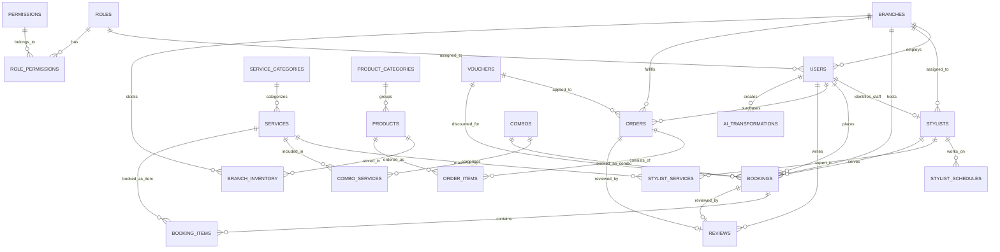

# BÁO CÁO PHÂN TÍCH KIẾN TRÚC & KHOẢNG TRỐNG HỆ THỐNG (GAP ANALYSIS & ARCHITECTURE SPECIFICATION)
## Đề tài: Xây Dựng Ứng Dụng Chuỗi Salon Tóc & E-Commerce All-In-One (OmniSalon / 4RAU Suite)
*Tài liệu chuẩn bị bởi Solution Architect & Business Analyst (Agent 1)*  
*Thời gian lập: Tháng 09/2026*

---

## MỤC LỤC
1. [TỔNG QUAN ĐỀ TÀI & HIỆN TRẠNG MÃ NGUỒN](#1-tổng-quan-đề-tài--hiện-trạng-mã-nguồn)
2. [GAP ANALYSIS: ĐỐI CHIẾU HIỆN CÓ VS CÒN THIẾU](#2-gap-analysis-đối-chiếu-hiện-có-vs-còn-thiếu)
   - 2.1. Ma trận chức năng tổng quan (Web & Mobile x Customer & Admin/Staff)
   - 2.2. Phân hệ Web (Khách hàng Customer & Quản trị Admin/Staff)
   - 2.3. Phân hệ Mobile (Khách hàng Customer & Quản lý/Thợ Staff/Admin)
   - 2.4. Tầng Dữ liệu, Trạng thái (Store) & Database Schema
   - 2.5. Tầng Bảo mật, Xác thực & Phân quyền (Auth & RBAC)
3. [THIẾT KẾ CƠ SỞ DỮ LIỆU & ERD CHUẨN DOANH NGHIỆP](#3-thiết-kế-cơ-sở-dữ-liệu--erd-chuẩn-doanh-nghiệp)
   - 3.1. Sơ đồ thực thể mối quan hệ (Mermaid ERD)
   - 3.2. Đặc tả chi tiết các bảng dữ liệu cốt lõi & mở rộng
   - 3.3. Ràng buộc toàn vẹn & Cơ chế chống trùng lịch (Anti-Double Booking)
4. [ĐẶC TẢ API CONTRACTS CHUẨN RESTFUL & PHÂN QUYỀN JWT RBAC](#4-đặc-tả-api-contracts-chuẩn-restful--phân-quyền-jwt-rbac)
   - 4.1. Cơ chế xác thực Bearer Token & Cấu trúc JWT Payload
   - 4.2. Ma trận phân quyền (RBAC Permission Matrix)
   - 4.3. Danh mục API Endpoints chi tiết theo từng phân hệ
5. [ĐỀ XUẤT ĐỊNH HƯỚNG TỔ CHỨC FILE CHO AGENT 2 (FILE MAPPER)](#5-đề-xuất-định-hướng-tổ-chức-file-cho-agent-2-file-mapper)

---

## 1. TỔNG QUAN ĐỀ TÀI & HIỆN TRẠNG MÃ NGUỒN

### 1.1. Mục tiêu đề tài
Xây dựng một nền tảng **All-in-One** tích hợp toàn diện:
- **Dịch vụ Salon Tóc chuyên nghiệp**: Đặt lịch theo chi nhánh, chọn thợ (stylist/barber), chọn khung giờ vàng chống trùng ca, tư vấn kiểu tóc với công nghệ **AI Photo Restyle Vision**.
- **Sàn thương mại điện tử (E-Commerce) phụ kiện & mỹ phẩm tóc**: Danh mục sáp vuốt, pomade, áo nón streetwear, giỏ hàng, thanh toán trực tuyến / COD, theo dõi đơn hàng.
- **Hệ thống đa nền tảng (Omni-channel)**:
  - Bản **Web Portal**: Responsive Desktop & Tablet.
  - Bản **Mobile App**: Hybrid/Native thông qua Capacitor Android / PWA.
- **Phân hệ kép trên cả 2 nền tảng**:
  - **Khách hàng (Customer)**: Đặt lịch, mua sắm, tích điểm, thư viện ảnh AI, lịch sử giao dịch.
  - **Quản trị & Nhân viên (Admin / Staff / Stylist)**: Điều phối ca cắt tóc, quản lý thợ, quản lý kho hàng liên chi nhánh, quản trị danh mục sản phẩm/dịch vụ/combo, báo cáo doanh thu & POS tại quầy.

### 1.2. Hiện trạng mã nguồn (As-Is Scan)
Qua quét toàn bộ cấu trúc thư mục và mã nguồn hiện tại:
- **Tập tin cấu trúc**:
  - `index.html`: Entry point cho Web Portal Desktop.
  - `app.html`: Entry point cho Mobile App (chạy trong khung giả lập điện thoại hoặc Native Android via Capacitor).
  - `manifest.json`, `capacitor.config.json`: Cấu hình PWA & Capacitor Native Wrapper.
  - `database_schema.sql`: Script DDL MySQL cơ bản gồm 9 bảng ban đầu.
- **Mã nguồn JavaScript (`js/`)**:
  - `js/core/data.js` (~713 dòng): Seed data tĩnh (18 chi nhánh, dịch vụ, 2 combo, sản phẩm, tin tức, 3 thợ mẫu, 1 lịch hẹn mẫu).
  - `js/core/utils.js`: Hàm format tiền tệ VNĐ, định dạng ngày tháng, initials avatar.
  - `js/core/store.js` (~494 dòng): Reactive Store dựa trên `localStorage` (`OMNISALON_4RAU_V5_LIVE`). Lưu trữ mảng in-memory: bookings, cart, orders, inventory, auditLogs, currentUser.
  - `js/core/api.js` (~287 dòng): Tầng API abstraction với cờ `useLiveApi: false`. Tích hợp module AI Canvas thông minh + API connectors (HuggingFace, OpenAI, Replicate).
  - `js/components/ui-common.js` (~1190 dòng): Component dùng chung (Product card, Booking Wizard modal, Cart Drawer, Auth modal, AI Studio modal, Toast).
  - `js/web/ui-web.js` (~1721 dòng): Render Web Customer Portal và một màn hình Admin thô sơ (`UIWeb.renderAdminView`).
  - `js/app/ui-app.js` (~793 dòng): Render Mobile App 5 tabs cho Khách hàng (Home, Booking, AI, Shop, Profile).
- **Mã nguồn Stylesheet (`css/`)**:
  - `css/base.css`, `css/common.css`, `css/web.css`, `css/app.css`: Hệ thống CSS tương đối hoàn chỉnh về màu sắc Terracotta (#c85a44), Glassmorphism, animations và bố cục.

---

## 2. GAP ANALYSIS: ĐỐI CHIẾU HIỆN CÓ VS CÒN THIẾU

### 2.1. Ma trận chức năng tổng quan

| Nhóm nghiệp vụ | Phân hệ | Yêu cầu chuẩn đề tài | Hiện trạng mã nguồn (As-Is) | Đánh giá & Khoảng trống (Gap) |
|---|---|---|---|---|
| **Đặt lịch (Booking)** | Web Customer | Đặt lịch theo dịch vụ/combo, chi nhánh, thợ, slot giờ | Đã có modal wizard đa bước, chống trùng giờ cục bộ | **Tốt**, thiếu bước hủy/đổi lịch nâng cao và mã QR vé |
| | Web Admin/Staff | Tiếp nhận lịch, phân ca thợ, đổi trạng thái, lọc chi nhánh | Đã có bảng danh sách lịch trong Admin view của web | **Khá**, thiếu phân quyền xem theo thợ/chi nhánh cụ thể |
| | Mobile Customer | Đặt lịch trực tiếp trên tab Booking, chọn thợ trực quan | Đã có tab Booking riêng biệt | **Tốt**, đồng bộ tốt với Store |
| | Mobile Staff | Xem lịch hẹn trong ngày của riêng thợ, check-in khách đến | **CHƯA CÓ** (Thợ không có giao diện xem ca làm trên mobile) | **THIẾU NGHIÊM TRỌNG** (Thợ phải dùng giao diện Web) |
| **Thương mại (E-Commerce)** | Web Customer | Xem sản phẩm, tìm kiếm, giỏ hàng, đặt hàng COD/QR | Đã có Card, Drawer giỏ hàng, Checkout cơ bản | **Khá**, thiếu địa chỉ xã/huyện, cổng thanh toán thật |
| | Web Admin | Quản lý kho, cập nhật giá, thêm sản phẩm mới, xem đơn hàng | Đã có xem tồn kho và cập nhật số lượng tồn kho | **Thiếu**: CRUD thêm/sửa/xóa sản phẩm, duyệt đơn hàng |
| | Mobile Customer | Tab Cửa hàng, mua sắm nhanh, thanh toán di động | Đã có tab Shop, thêm vào giỏ, checkout drawer | **Tốt**, cần thêm theo dõi trạng thái đơn hàng (Tracking) |
| | Mobile Staff/Admin | Quản lý xuất nhập kho nhanh bằng barcode/QR, POS quầy | **CHƯA CÓ** trên Mobile | **THIẾU** |
| **Phân quyền & Tài khoản** | Web & Mobile | JWT Role: Admin, BranchManager, Stylist, Customer | Chỉ có mock user (`usr-1`, `usr-admin`) lưu LocalStorage | **THIẾU TOÀN DIỆN**: Chưa có JWT Token, chưa có middleware |
| **Combo Dịch Vụ** | Đa nền tảng | Quản lý gói combo nhiều dịch vụ kết hợp, tính thời lượng | Mock cứng 2 combo trong `data.js`, DB SQL chưa có bảng Combos | **THIẾU CẤU TRÚC BẢNG**: Chưa có bảng `combos` & `combo_services` |
| **Báo cáo & Doanh thu** | Web Admin | Doanh thu theo ngày/tuần/tháng, theo thợ, theo chi nhánh | Có hàm `getRevenueAnalytics()` với số liệu mock cứng | **Thiếu**: Lọc thời gian động, tính hoa hồng cho từng Barber |
| | Mobile Staff/Admin | Xem doanh thu ca cá nhân của thợ, doanh thu ngày chi nhánh | **CHƯA CÓ** trên Mobile | **THIẾU HOÀN TOÀN** |
| **Giao diện Quản trị Mobile** | Mobile Staff/Admin | Phân hệ Admin/Staff trên ứng dụng di động | Bấm quản trị trên mobile chuyển hướng sang `index.html`! | **VI PHẠM YÊU CẦU ĐỀ TÀI**: Mobile chưa có phân hệ Admin/Staff |

---

### 2.2. Phân tích chi tiết Phân hệ Web

#### Cái đã có (As-Is):
1. **Web Customer Portal**:
   - Header tích hợp Live Search thời gian thực tìm sản phẩm & dịch vụ.
   - 14 Sections hoàn chỉnh: Hero banner, Bạn đến nhà, Dịch vụ đặc trưng, Sản phẩm mới, Sản phẩm bán chạy, Tin tóc Underground, Chi nhánh, FAQ, Bản đồ.
   - Modal Đặt lịch cắt tóc 4 bước (`UICommon.bookingData`): chọn dịch vụ/combo, chọn chi nhánh, chọn barber và khung giờ khả dụng (đã có thuật toán loại bỏ slot trùng).
   - Live AI Photo Restyle Studio trực tiếp trên trang chủ: Cho phép upload ảnh, chụp webcam, chọn kiểu tóc + màu tóc, áp dụng bộ lọc canvas siêu nét có tem bản quyền.
   - Tra cứu lịch hẹn (`openLookupModal`) theo SĐT hoặc Mã lịch hẹn.
   - Giỏ hàng trượt Drawer + thông báo Toast.

2. **Web Admin Hub** (`UIWeb.renderAdminView`):
   - Chuyển đổi tab "👑 Quản Trị Salon" trên Header.
   - 5 phân mục: Tổng quan & Phân tích (KPIs, biểu đồ tuần, tỉ trọng dịch vụ), Quản lý lịch hẹn (lọc chi nhánh/trạng thái, cập nhật trạng thái lịch, xóa lịch), Đội ngũ Barber, Quản lý kho hàng & POS, Nhật ký hoạt động (Audit Logs).

#### Cái còn thiếu (To-Be Gaps):
1. **Bảo mật & Phân quyền thực tế (Security & RBAC)**:
   - Hiện tại, bất kỳ ai vào Web đều bấm được nút "👑 Quản Trị Salon" mà không qua kiểm tra quyền (Permission Guard).
   - Chưa có phân quyền chi tiết: SuperAdmin (toàn quyền hệ thống), BranchManager (chỉ xem và duyệt lịch của chi nhánh mình), Receptionist (tiếp tân thu ngân tại quầy), Stylist (thợ chỉ xem lịch phục vụ của mình).
2. **Quản trị CRUD Danh mục (Catalog Management)**:
   - Thiếu màn hình Thêm / Sửa / Khóa dịch vụ, combo gói và sản phẩm. Hiện tại dữ liệu dịch vụ và sản phẩm bị khóa cứng trong seed data.
3. **Mô hình POS Bán lẻ tại quầy (Counter POS)**:
   - Chưa có giao diện POS cho thu ngân tạo nhanh đơn hàng khi khách vừa cắt tóc vừa mua thêm sáp tại quầy, xuất hóa đơn in nhiệt / hóa đơn điện tử.
4. **Phân hệ Khách hàng cá nhân (Customer Dashboard)**:
   - Khách đăng nhập chưa có trang cá nhân riêng để xem lịch sử các lần cắt, hình ảnh tóc đã từng tạo bằng AI, điểm thưởng tích lũy (Reward Points) và danh sách đơn hàng đã mua.

---

### 2.3. Phân tích chi tiết Phân hệ Mobile

#### Cái đã có (As-Is):
1. Khung hiển thị mô phỏng thiết bị Android với punch-hole camera, status bar đồng hồ động, cột sóng 5G và pin.
2. Bottom Navigation Bar 5 tabs chuẩn di động:
   - **Tab 1 (Trang chủ)**: Carousel banner, danh sách dịch vụ nhanh, sản phẩm hot.
   - **Tab 2 (Đặt lịch)**: Giao diện Wizard tối ưu cho thao tác chạm (touch-friendly).
   - **Tab 3 (Thử tóc AI)**: Màn hình Studio AI so sánh Before/After với thanh trượt mượt mà.
   - **Tab 4 (Cửa hàng)**: Grid 2 cột sản phẩm với nút thêm nhanh vào giỏ.
   - **Tab 5 (Cá nhân)**: Thông tin tài khoản, hiển thị lịch hẹn gần nhất, nút mở trang CH Play giả lập.

#### Cái còn thiếu (To-Be Gaps - ĐẶC BIỆT QUAN TRỌNG):
1. **Hoàn toàn thiếu Phân hệ Quản trị Admin/Staff trên Mobile**:
   - Trong `js/app/ui-app.js` (dòng 710), nút quản trị chỉ thực hiện: `onclick="window.location.href='index.html';"`. Điều này hoàn toàn phá vỡ trải nghiệm native app trên di động.
   - Đề tài yêu cầu: **Cả Web và Mobile đều có phân hệ Quản trị Admin/Staff**.
   - Cần bổ sung ngay trên Mobile:
     - Cơ chế chuyển đổi chế độ (Role-based View Switcher): Khi tài khoản đăng nhập là `admin`, `manager`, `stylist`, ứng dụng tự động hiển thị giao diện **Mobile Staff / Admin Console**.
     - **Tab Ca làm của Thợ (Stylist Schedule)**: Danh sách khách đã đặt trong ngày, nút 1-chạm "Check-in khách đến" -> "Bắt đầu cắt" -> "Hoàn thành".
     - **Tab Thu ngân / POS Mobile (Quick Cashier)**: Quét mã QR vé lịch hẹn hoặc tạo hóa đơn nhanh tại ghế cắt tóc.
     - **Tab Quản lý kho nhanh (Mobile Inventory)**: Quản lý nhanh số lượng sáp tại quầy chi nhánh, kiểm kho cuối ngày.
     - **Tab Báo cáo nhanh (Quick Stats)**: Doanh thu ngày của chi nhánh, số ca đã phục vụ, hoa hồng tạm tính của thợ.
2. **Notification Push & Trạng thái đơn hàng di động**:
   - Chưa có màn hình hiển thị danh sách thông báo đẩy (Lịch hẹn sắp đến, Khuyến mãi mới).
   - Chưa có màn hình Timeline đơn hàng (Đang xử lý -> Đang giao -> Đã nhận).

---

### 2.4. Tầng Dữ liệu, Trạng thái (Store) & Database Schema

#### Cái đã có (As-Is):
- File `database_schema.sql` đã khởi tạo 9 bảng: `branches`, `stylists`, `services`, `bookings`, `products`, `orders`, `order_items`, `users`, `ai_transformations`.
- Store phía client (`js/core/store.js`) có cấu trúc lưu trữ cơ bản tương ứng.

#### Cái còn thiếu (To-Be Gaps):
1. **Bảng Combos & Combo_Services**:
   - Hiện tại trong SQL hoàn toàn **chưa có bảng combos**! Dữ liệu `combos` chỉ đang tồn tại trong code JS `data.js`. Trong khi đó, mô hình kinh doanh Salon tóc sống nhờ các combo (Combo Cắt + Gội + Cạo mặt + Vuốt sáp). Cần thiết kế bảng `combos` và bảng liên kết nhiều-nhiều `combo_services`.
2. **Bảng Phân quyền (Roles & Permissions)**:
   - Trong SQL, bảng `users` chỉ dùng trường `role ENUM('SuperAdmin', 'BranchManager', 'Stylist', 'Customer')`. Mô hình này không thể mở rộng quyền hạn động (ví dụ: Tiếp tân được xem lịch nhưng không được sửa giá dịch vụ; Quản lý kho chỉ được nhập xuất hàng).
   - Cần tách thành 3 bảng chuẩn: `roles`, `permissions`, `role_permissions` hoặc chuẩn hóa bảng `roles` có cấu trúc rõ ràng.
3. **Liên kết Stylists với Tài khoản User (`user_id`)**:
   - Hiện tại bảng `stylists` đứng độc lập, không có khóa ngoại `user_id`. Do đó thợ cắt tóc không thể đăng nhập vào hệ thống để nhận lịch của chính mình.
4. **Bảng Tồn kho theo từng chi nhánh (`branch_inventory`)**:
   - Bảng `products` trong SQL chỉ có cột `stock_quantity INT`, nghĩa là số lượng tồn kho toàn hệ thống chung chung. Tuy nhiên, chuỗi có 18 chi nhánh, mỗi chi nhánh có lượng sáp tồn riêng biệt. Cần bảng `branch_inventory` (product_id, branch_id, stock_quantity, min_alert).
5. **Bảng Chi tiết Dịch vụ của Lịch hẹn (`booking_services`)**:
   - Bảng `bookings` trong SQL chỉ lưu duy nhất 1 `service_id`. Nếu khách hàng muốn đặt Combo + Dịch vụ thêm (như Ép side + Cắt tóc), hệ thống hiện tại không thể biểu diễn được.
6. **Bảng Khuyến mãi & Voucher (`vouchers`)**:
   - Chưa có trong SQL (chỉ có mảng tĩnh trong `data.js`).

---

### 2.5. Tầng Bảo mật, Xác thực & Phân quyền (Auth & RBAC)

#### Cái đã có:
- Hàm `login(email, password)` trong `SalonStore` so khớp chuỗi trần đơn giản trong mảng `this.state.users`.

#### Cái còn thiếu:
- Chưa có chuẩn mã hóa mật khẩu (`bcrypt` / `argon2`).
- Chưa có chuẩn phát hành mã xác thực **JSON Web Token (JWT)** gồm `AccessToken` (hạn ngắn 15-60 phút) và `RefreshToken` (lưu HttpOnly cookie hoặc secure storage).
- Chưa có Middleware kiểm tra Header `Authorization: Bearer <token>` tại các API endpoints.
- Chưa có cơ chế bảo vệ phân quyền (Role Guards) để ngăn chặn truy cập trái phép chéo giữa các chi nhánh (Data Isolation theo `branch_id`).

---

## 3. THIẾT KẾ CƠ SỞ DỮ LIỆU & ERD CHUẨN DOANH NGHIỆP

Để giải quyết triệt để các khoảng trống (Gaps) đã phân tích, sơ đồ thực thể mối quan hệ (ERD) được thiết kế đầy đủ, bao quát toàn bộ 8 nhóm thực thể cốt lõi theo đề tài (`Users`, `Roles`, `Stylists`, `Services`, `Combos`, `Bookings`, `Products`, `Orders`) cùng các bảng liên kết bổ trợ cần thiết.

### 3.1. Sơ đồ thực thể mối quan hệ (Mermaid ERD)



---

### 3.2. Đặc tả chi tiết các bảng dữ liệu cốt lõi & mở rộng

#### 1. Nhóm Phân Quyền & Người Dùng (Users, Roles, Permissions)

##### Bảng `roles` (Vai trò người dùng)
| Tên cột | Kiểu dữ liệu | Ràng buộc | Mô tả |
|---|---|---|---|
| `id` | VARCHAR(36) | PRIMARY KEY | Định danh vai trò (UUID) |
| `code` | VARCHAR(50) | UNIQUE, NOT NULL | Mã vai trò: `SUPER_ADMIN`, `BRANCH_MANAGER`, `STYLIST`, `CASHIER`, `CUSTOMER` |
| `name` | VARCHAR(100) | NOT NULL | Tên hiển thị: Quản trị tối cao, Quản lý cơ sở, Thợ cắt tóc, Thu ngân, Khách hàng |
| `description` | VARCHAR(255) | NULL | Mô tả phạm vi quyền hạn |
| `created_at` | TIMESTAMP | DEFAULT CURRENT_TIMESTAMP | Ngày tạo vai trò |

##### Bảng `permissions` (Danh mục quyền nguyên tử)
| Tên cột | Kiểu dữ liệu | Ràng buộc | Mô tả |
|---|---|---|---|
| `id` | VARCHAR(36) | PRIMARY KEY | Định danh quyền (UUID) |
| `code` | VARCHAR(100) | UNIQUE, NOT NULL | Mã quyền: `booking:create`, `booking:view_all`, `inventory:update`, v.v. |
| `module` | VARCHAR(50) | NOT NULL | Phân hệ: `BOOKING`, `INVENTORY`, `REPORT`, `USER`, `PRODUCT` |
| `description` | VARCHAR(255) | NULL | Diễn giải chức năng cho phép thực thi |

##### Bảng `role_permissions` (Bảng liên kết vai trò - quyền)
| Tên cột | Kiểu dữ liệu | Ràng buộc | Mô tả |
|---|---|---|---|
| `role_id` | VARCHAR(36) | NOT NULL, FK -> roles(id) ON DELETE CASCADE | ID vai trò |
| `permission_id` | VARCHAR(36) | NOT NULL, FK -> permissions(id) ON DELETE CASCADE | ID quyền tương ứng |
| PRIMARY KEY (`role_id`, `permission_id`) | | | Khóa chính phức hợp |

##### Bảng `users` (Tài khoản người dùng toàn hệ thống)
| Tên cột | Kiểu dữ liệu | Ràng buộc | Mô tả |
|---|---|---|---|
| `id` | VARCHAR(36) | PRIMARY KEY | Mã người dùng UUID |
| `role_id` | VARCHAR(36) | NOT NULL, FK -> roles(id) | Vai trò chính của tài khoản |
| `branch_id` | VARCHAR(50) | NULL, FK -> branches(id) | Chi nhánh làm việc (NULL nếu là Khách hàng hoặc SuperAdmin) |
| `username` | VARCHAR(100) | UNIQUE, NOT NULL | Tên đăng nhập |
| `password_hash` | VARCHAR(255) | NOT NULL | Chuỗi băm mật khẩu bảo mật (Bcrypt/Argon2) |
| `full_name` | VARCHAR(150) | NOT NULL | Họ và tên đầy đủ |
| `email` | VARCHAR(150) | UNIQUE, NOT NULL | Email liên hệ & nhận hóa đơn điện tử |
| `phone` | VARCHAR(30) | UNIQUE, NOT NULL | Số điện thoại nhận OTP / SMS lịch hẹn |
| `avatar_url` | TEXT | NULL | Đường dẫn ảnh đại diện |
| `reward_points` | INT | DEFAULT 0 | Điểm tích lũy thành viên 4RAU Member |
| `tier` | VARCHAR(50) | DEFAULT 'Standard' | Hạng thành viên: `Standard`, `Silver`, `Gold`, `VIP Chủ Tịch` |
| `is_active` | TINYINT(1) | DEFAULT 1 | Trạng thái hoạt động (1: Kích hoạt, 0: Khóa) |
| `created_at` | TIMESTAMP | DEFAULT CURRENT_TIMESTAMP | Thời gian tạo tài khoản |
| `updated_at` | TIMESTAMP | ON UPDATE CURRENT_TIMESTAMP | Thời gian cập nhật gần nhất |

---

#### 2. Nhóm Chi Nhánh, Thợ Cắt Tóc & Lịch Trực (Branches, Stylists)

##### Bảng `branches` (Chuỗi chi nhánh hệ thống)
| Tên cột | Kiểu dữ liệu | Ràng buộc | Mô tả |
|---|---|---|---|
| `id` | VARCHAR(50) | PRIMARY KEY | Mã chi nhánh (ví dụ: `br-dbp`, `br-nb`, `br-q5`) |
| `branch_group` | VARCHAR(100) | NOT NULL | Nhóm thương hiệu: `4RAU BARBER CUTCLUB` hoặc `TIỆM TÓC CỦA CHỦ TỊCH` |
| `name` | VARCHAR(255) | NOT NULL | Tên chi nhánh đầy đủ |
| `address` | TEXT | NOT NULL | Địa chỉ thực tế |
| `phone` | VARCHAR(50) | NOT NULL | Số hotline chi nhánh (1900 4407 nhánh con) |
| `hours` | VARCHAR(100) | DEFAULT '08:30 - 21:00' | Giờ hoạt động mở/đóng cửa |
| `total_chairs` | INT | DEFAULT 12 | Số ghế phục vụ đồng thời |
| `image_url` | TEXT | NULL | Ảnh không gian chi nhánh |
| `manager_id` | VARCHAR(36) | NULL, FK -> users(id) | Quản lý phụ trách cơ sở |
| `is_active` | TINYINT(1) | DEFAULT 1 | 1: Đang hoạt động, 0: Đang sửa chữa/ngừng |
| `created_at` | TIMESTAMP | DEFAULT CURRENT_TIMESTAMP | Ngày mở chi nhánh |

##### Bảng `stylists` (Hồ sơ thợ cắt tóc / Barber chuyên nghiệp)
| Tên cột | Kiểu dữ liệu | Ràng buộc | Mô tả |
|---|---|---|---|
| `id` | VARCHAR(50) | PRIMARY KEY | Mã thợ (ví dụ: `st-1`, `st-2`) |
| `user_id` | VARCHAR(36) | UNIQUE, NULL, FK -> users(id) | Khóa ngoại liên kết tài khoản để thợ đăng nhập Mobile Staff |
| `branch_id` | VARCHAR(50) | NOT NULL, FK -> branches(id) | Chi nhánh làm việc cố định |
| `name` | VARCHAR(150) | NOT NULL | Nghệ danh / Tên thợ |
| `title` | VARCHAR(100) | DEFAULT 'Senior Barber' | Cấp bậc: `Master Barber`, `Senior Barber`, `Junior Barber` |
| `avatar_url` | TEXT | NULL | Ảnh chân dung thợ |
| `rating` | DECIMAL(2,1) | DEFAULT 5.0 | Đánh giá trung bình từ khách hàng (1.0 - 5.0) |
| `review_count` | INT | DEFAULT 0 | Tổng số lượt khách đã đánh giá |
| `experience_years`| INT | DEFAULT 3 | Số năm thâm niên trong nghề |
| `specialty` | TEXT | NULL | Thế mạnh kỹ thuật (Fade, Uốn con sâu, Cạo khăn nóng) |
| `bio` | TEXT | NULL | Tiểu sử & phong cách cá nhân |
| `commission_rate` | DECIMAL(4,2) | DEFAULT 0.15 | Tỉ lệ phần trăm hoa hồng trên mỗi ca hoàn thành (15%) |
| `is_available` | TINYINT(1) | DEFAULT 1 | 1: Sẵn sàng nhận khách, 0: Đang bận/nghỉ phép |
| `is_active` | TINYINT(1) | DEFAULT 1 | Trạng thái nhân sự còn làm việc hay đã nghỉ |

##### Bảng `stylist_schedules` (Lịch trực ca hàng tuần của Thợ)
| Tên cột | Kiểu dữ liệu | Ràng buộc | Mô tả |
|---|---|---|---|
| `id` | BIGINT AUTO_INCREMENT | PRIMARY KEY | Khóa chính tự tăng |
| `stylist_id` | VARCHAR(50) | NOT NULL, FK -> stylists(id) | Mã thợ |
| `day_of_week` | ENUM('Mon','Tue','Wed','Thu','Fri','Sat','Sun') | NOT NULL | Thứ trong tuần |
| `start_time` | TIME | NOT NULL DEFAULT '08:30:00' | Giờ bắt đầu ca làm |
| `end_time` | TIME | NOT NULL DEFAULT '21:00:00' | Giờ kết thúc ca làm |
| `is_day_off` | TINYINT(1) | DEFAULT 0 | 1: Ngày nghỉ tuần định kỳ của thợ |

---

#### 3. Nhóm Danh Mục Dịch Vụ & Combo Gói (Services, Combos)

##### Bảng `service_categories` (Nhóm dịch vụ)
| Tên cột | Kiểu dữ liệu | Ràng buộc | Mô tả |
|---|---|---|---|
| `id` | VARCHAR(50) | PRIMARY KEY | Mã nhóm (`haircut`, `perm`, `color`, `shave`, `spa`) |
| `name` | VARCHAR(100) | NOT NULL | Tên nhóm: Cắt tạo kiểu, Uốn texture, Nhuộm tóc, Cạo mặt |
| `display_order` | INT | DEFAULT 0 | Thứ tự hiển thị ưu tiên |

##### Bảng `services` (Danh mục dịch vụ đơn lẻ)
| Tên cột | Kiểu dữ liệu | Ràng buộc | Mô tả |
|---|---|---|---|
| `id` | VARCHAR(50) | PRIMARY KEY | Mã dịch vụ (`srv-1`, `srv-2`, v.v.) |
| `category_id` | VARCHAR(50) | NOT NULL, FK -> service_categories(id) | Nhóm dịch vụ |
| `name` | VARCHAR(255) | NOT NULL | Tên dịch vụ chi tiết |
| `price` | DECIMAL(12,2) | NOT NULL | Giá dịch vụ niêm yết (VNĐ) |
| `duration_minutes` | INT | DEFAULT 45 | Thời lượng thực hiện ước tính (phút) |
| `description` | TEXT | NULL | Mô tả các bước kỹ thuật trong quy trình |
| `image_url` | TEXT | NULL | Ảnh mẫu kết quả dịch vụ |
| `is_popular` | TINYINT(1) | DEFAULT 0 | 1: Dịch vụ hot gắn cờ HOT trên Menu |
| `is_active` | TINYINT(1) | DEFAULT 1 | 1: Đang phục vụ, 0: Tạm ngưng |
| `created_at` | TIMESTAMP | DEFAULT CURRENT_TIMESTAMP | Ngày tạo |

##### Bảng `combos` (Gói Combo VIP tích hợp nhiều dịch vụ)
| Tên cột | Kiểu dữ liệu | Ràng buộc | Mô tả |
|---|---|---|---|
| `id` | VARCHAR(50) | PRIMARY KEY | Mã combo (`cmb-1`, `cmb-2`, v.v.) |
| `name` | VARCHAR(255) | NOT NULL | Tên combo: *COMBO 4RAU SIGNATURE, COMBO ĐẾ VƯƠNG* |
| `price` | DECIMAL(12,2) | NOT NULL | Giá trọn gói ưu đãi (VNĐ) |
| `original_price` | DECIMAL(12,2) | NOT NULL | Tổng giá gốc các dịch vụ nếu làm lẻ |
| `duration_minutes` | INT | DEFAULT 75 | Tổng thời lượng phục vụ gói (phút) |
| `description` | TEXT | NULL | Chi tiết quyền lợi và các bước trong gói |
| `image_url` | TEXT | NULL | Ảnh banner đại diện combo |
| `is_popular` | TINYINT(1) | DEFAULT 1 | Đánh dấu combo nổi bật |
| `is_active` | TINYINT(1) | DEFAULT 1 | 1: Cho phép khách đặt, 0: Ẩn |
| `created_at` | TIMESTAMP | DEFAULT CURRENT_TIMESTAMP | Ngày ban hành combo |

##### Bảng `combo_services` (Thành phần chi tiết của Combo)
| Tên cột | Kiểu dữ liệu | Ràng buộc | Mô tả |
|---|---|---|---|
| `id` | BIGINT AUTO_INCREMENT | PRIMARY KEY | Khóa tự tăng |
| `combo_id` | VARCHAR(50) | NOT NULL, FK -> combos(id) ON DELETE CASCADE | Thuộc gói combo nào |
| `service_id` | VARCHAR(50) | NOT NULL, FK -> services(id) ON DELETE CASCADE | Dịch vụ thành phần nào |
| `sequence_order` | INT | DEFAULT 1 | Thứ tự thực hiện các bước trong gói |

---

#### 4. Nhóm Đặt Lịch & Chống Trùng Giờ (Bookings)

##### Bảng `bookings` (Phiếu đặt lịch cắt tóc)
| Tên cột | Kiểu dữ liệu | Ràng buộc | Mô tả |
|---|---|---|---|
| `id` | VARCHAR(50) | PRIMARY KEY | Mã lịch hẹn dạng thân thiện: `BK-1001` |
| `booking_code` | VARCHAR(20) | UNIQUE, NOT NULL | Mã code ngắn cho khách tra cứu nhanh hoặc quét QR |
| `user_id` | VARCHAR(36) | NULL, FK -> users(id) | Tài khoản khách (NULL nếu là khách vãng lai/đặt nhanh) |
| `branch_id` | VARCHAR(50) | NOT NULL, FK -> branches(id) | Chi nhánh phục vụ |
| `stylist_id` | VARCHAR(50) | NOT NULL, FK -> stylists(id) | Thợ được khách chỉ định hoặc điều phối |
| `combo_id` | VARCHAR(50) | NULL, FK -> combos(id) | Gói combo lựa chọn (nếu có) |
| `customer_name` | VARCHAR(150) | NOT NULL | Tên người nhận lịch hẹn |
| `customer_phone` | VARCHAR(30) | NOT NULL | Số điện thoại nhận SMS / Call xác nhận |
| `customer_email` | VARCHAR(150) | NULL | Email gửi vé đặt lịch điện tử |
| `booking_date` | DATE | NOT NULL | Ngày thực hiện lịch hẹn |
| `time_slot` | VARCHAR(20) | NOT NULL | Khung giờ bắt đầu (VD: `09:30`, `14:30`) |
| `estimated_end_time`| TIME | NOT NULL | Giờ kết thúc dự kiến (time_slot + tổng duration) |
| `total_price` | DECIMAL(12,2) | NOT NULL | Tổng tiền dịch vụ dự tính thanh toán |
| `deposit_amount` | DECIMAL(12,2) | DEFAULT 0 | Tiền đặt cọc giữ chỗ trước (nếu áp dụng giờ cao điểm) |
| `status` | ENUM('Pending', 'Confirmed', 'In_Progress', 'Completed', 'Cancelled', 'No_Show') | DEFAULT 'Confirmed' | Vòng đời trạng thái lịch |
| `payment_status` | ENUM('Unpaid', 'Partially_Paid', 'Paid') | DEFAULT 'Unpaid' | Tình trạng thanh toán |
| `payment_method` | VARCHAR(50) | DEFAULT 'Counter_Cash' | Hình thức: Tiền mặt tại quầy, VietQR, Chuyển khoản |
| `notes` | TEXT | NULL | Yêu cầu riêng từ khách (kèm kiểu tóc AI mong muốn) |
| `cancellation_reason` | TEXT | NULL | Lý do hủy lịch nếu khách hoặc salon hủy |
| `checked_in_at` | TIMESTAMP | NULL | Thời điểm khách thực tế có mặt tại salon |
| `completed_at` | TIMESTAMP | NULL | Thời điểm barber hoàn tất ca phục vụ |
| `created_at` | TIMESTAMP | DEFAULT CURRENT_TIMESTAMP | Thời gian đặt lịch |
| `updated_at` | TIMESTAMP | ON UPDATE CURRENT_TIMESTAMP | Thời gian chỉnh sửa trạng thái |

##### Bảng `booking_items` (Chi tiết các dịch vụ trong lịch hẹn)
| Tên cột | Kiểu dữ liệu | Ràng buộc | Mô tả |
|---|---|---|---|
| `id` | BIGINT AUTO_INCREMENT | PRIMARY KEY | Khóa tự tăng |
| `booking_id` | VARCHAR(50) | NOT NULL, FK -> bookings(id) ON DELETE CASCADE | Lịch hẹn liên kết |
| `service_id` | VARCHAR(50) | NOT NULL, FK -> services(id) | Dịch vụ được chọn thêm |
| `price_at_booking`| DECIMAL(12,2) | NOT NULL | Giá tiền tại thời điểm đặt |
| `duration_minutes`| INT | NOT NULL | Thời lượng dịch vụ |

---

#### 5. Nhóm Sản Phẩm, Kho Hàng & E-Commerce (Products, Inventory, Orders)

##### Bảng `product_categories` (Danh mục sản phẩm)
| Tên cột | Kiểu dữ liệu | Ràng buộc | Mô tả |
|---|---|---|---|
| `id` | VARCHAR(50) | PRIMARY KEY | Mã danh mục (`pomade`, `wax`, `apparel`, `accessories`) |
| `name` | VARCHAR(100) | NOT NULL | Tên: Pomade, Sáp vuốt, Thời trang Streetwear, Phụ kiện |

##### Bảng `products` (Danh mục sản phẩm bán lẻ)
| Tên cột | Kiểu dữ liệu | Ràng buộc | Mô tả |
|---|---|---|---|
| `id` | VARCHAR(50) | PRIMARY KEY | Mã sản phẩm (`prod-new-1`, `prod-best-1`) |
| `category_id` | VARCHAR(50) | NOT NULL, FK -> product_categories(id) | Danh mục hàng hóa |
| `sku` | VARCHAR(50) | UNIQUE, NOT NULL | Mã mã vạch SKU quản lý kho |
| `name` | VARCHAR(255) | NOT NULL | Tên sản phẩm đầy đủ |
| `brand` | VARCHAR(100) | DEFAULT 'BROSH JAPAN' | Thương hiệu sản xuất |
| `section` | VARCHAR(50) | DEFAULT 'new' | Phân mục trang chủ: `new` (Mới về), `best` (Bán chạy) |
| `price` | DECIMAL(12,2) | NOT NULL | Giá bán lẻ tới khách hàng |
| `original_price` | DECIMAL(12,2) | NULL | Giá gạch cũ trước khuyến mãi |
| `cost_price` | DECIMAL(12,2) | NULL | Giá vốn nhập hàng (chỉ Admin xem) |
| `image_url` | TEXT | NOT NULL | Ảnh chụp thực tế sản phẩm |
| `description` | TEXT | NULL | Công dụng, mùi hương, độ giữ nếp |
| `is_active` | TINYINT(1) | DEFAULT 1 | 1: Đang bán, 0: Dừng kinh doanh |
| `created_at` | TIMESTAMP | DEFAULT CURRENT_TIMESTAMP | Ngày tạo |

##### Bảng `branch_inventory` (Tồn kho chi tiết theo từng cơ sở)
| Tên cột | Kiểu dữ liệu | Ràng buộc | Mô tả |
|---|---|---|---|
| `id` | VARCHAR(50) | PRIMARY KEY | Mã bản ghi (`inv-1`, `inv-2`) |
| `branch_id` | VARCHAR(50) | NOT NULL, FK -> branches(id) ON DELETE CASCADE | Chi nhánh lưu kho |
| `product_id` | VARCHAR(50) | NOT NULL, FK -> products(id) ON DELETE CASCADE | Sản phẩm trong kho |
| `stock_quantity` | INT | DEFAULT 0, CHECK (stock_quantity >= 0) | Số lượng tồn thực tế trên kệ |
| `min_alert` | INT | DEFAULT 5 | Ngưỡng báo động thiếu hàng cần nhập thêm |
| `last_restocked_at`| TIMESTAMP | NULL | Ngày nhập hàng gần nhất |
| UNIQUE KEY (`branch_id`, `product_id`) | | | Mỗi chi nhánh chỉ có 1 dòng cho mỗi sản phẩm |

##### Bảng `orders` (Đơn hàng thương mại điện tử & POS)
| Tên cột | Kiểu dữ liệu | Ràng buộc | Mô tả |
|---|---|---|---|
| `id` | VARCHAR(50) | PRIMARY KEY | Mã đơn hàng: `ORD-101` |
| `order_code` | VARCHAR(20) | UNIQUE, NOT NULL | Mã tra cứu đơn hàng |
| `user_id` | VARCHAR(36) | NULL, FK -> users(id) | Tài khoản khách hàng |
| `branch_id` | VARCHAR(50) | NOT NULL, FK -> branches(id) | Chi nhánh đóng gói xuất hàng hoặc quầy POS |
| `order_type` | ENUM('ONLINE_DELIVERY', 'POS_COUNTER') | DEFAULT 'ONLINE_DELIVERY' | Đơn ship tận nơi hoặc mua trực tiếp tại tiệm |
| `customer_name` | VARCHAR(150) | NOT NULL | Tên người nhận hàng |
| `customer_phone` | VARCHAR(30) | NOT NULL | Số điện thoại nhận hàng |
| `shipping_address`| TEXT | NULL | Địa chỉ giao hàng đầy đủ (nếu ship tận nhà) |
| `total_amount` | DECIMAL(12,2) | NOT NULL | Tổng tiền cần thanh toán |
| `discount_amount`| DECIMAL(12,2) | DEFAULT 0 | Số tiền được giảm giá qua voucher |
| `payment_method` | VARCHAR(50) | DEFAULT 'COD' | COD, VietQR, Chuyển khoản, Thẻ POS |
| `payment_status` | ENUM('Unpaid', 'Paid', 'Refunded') | DEFAULT 'Unpaid' | Trạng thái thanh toán |
| `order_status` | ENUM('Pending', 'Processing', 'Shipping', 'Completed', 'Cancelled') | DEFAULT 'Pending' | Vòng đời đơn hàng |
| `created_at` | TIMESTAMP | DEFAULT CURRENT_TIMESTAMP | Thời gian đặt hàng |

##### Bảng `order_items` (Chi tiết các mặt hàng trong đơn)
| Tên cột | Kiểu dữ liệu | Ràng buộc | Mô tả |
|---|---|---|---|
| `id` | BIGINT AUTO_INCREMENT | PRIMARY KEY | Khóa tự tăng |
| `order_id` | VARCHAR(50) | NOT NULL, FK -> orders(id) ON DELETE CASCADE | Khóa ngoại tới đơn hàng |
| `product_id` | VARCHAR(50) | NOT NULL, FK -> products(id) | Khóa ngoại tới sản phẩm |
| `quantity` | INT | NOT NULL DEFAULT 1 | Số lượng mua |
| `unit_price` | DECIMAL(12,2) | NOT NULL | Đơn giá tại thời điểm xuất đơn |
| `subtotal` | DECIMAL(12,2) | NOT NULL | Thành tiền (quantity * unit_price) |

---

#### 6. Nhóm Bổ Trợ (AI Transformations, Vouchers, Audit Logs, Notifications)

##### Bảng `ai_transformations` (Lịch sử mô phỏng kiểu tóc AI)
| Tên cột | Kiểu dữ liệu | Ràng buộc | Mô tả |
|---|---|---|---|
| `id` | VARCHAR(50) | PRIMARY KEY | Mã lượt biến đổi ảnh |
| `user_id` | VARCHAR(36) | NULL, FK -> users(id) | Người dùng thực hiện |
| `original_image_url`| TEXT | NOT NULL | Link ảnh gốc khách hàng tải lên |
| `result_image_url` | TEXT | NOT NULL | Link ảnh AI đã vẽ lại kiểu tóc |
| `selected_hairstyle`| VARCHAR(150) | NOT NULL | Kiểu tóc đã chọn (Side Part, Buzz Cut, Wolf Cut) |
| `selected_color` | VARCHAR(100) | NULL | Màu tóc nhuộm (Khói xám bạc, Nâu tây lạnh) |
| `provider_used` | VARCHAR(50) | DEFAULT '4RAU Neural Engine' | Nhà cung cấp AI (Neural Canvas, HuggingFace, OpenAI) |
| `created_at` | TIMESTAMP | DEFAULT CURRENT_TIMESTAMP | Thời điểm tạo |

##### Bảng `audit_logs` (Nhật ký giám sát hệ thống của Admin)
| Tên cột | Kiểu dữ liệu | Ràng buộc | Mô tả |
|---|---|---|---|
| `id` | VARCHAR(50) | PRIMARY KEY | Mã log |
| `user_id` | VARCHAR(36) | NULL, FK -> users(id) | Người thao tác |
| `operator_name` | VARCHAR(150) | NOT NULL | Tên người dùng và vai trò tại thời điểm thao tác |
| `action` | VARCHAR(100) | NOT NULL | Hành động: `CREATE_BOOKING`, `UPDATE_STOCK`, `LOGIN`, `CANCEL_ORDER` |
| `entity` | VARCHAR(100) | NOT NULL | Đối tượng bị tác động (`Booking #BK-1001`, `Inventory #inv-1`) |
| `details` | TEXT | NULL | Nội dung chi tiết thay đổi |
| `created_at` | TIMESTAMP | DEFAULT CURRENT_TIMESTAMP | Thời gian ghi nhận |

---

### 3.3. Ràng buộc toàn vẹn & Cơ chế chống trùng lịch (Anti-Double Booking)

1. **Khóa Unique chống trùng lịch trên Database**:
   - Để ngăn chặn tình trạng 2 khách hàng cùng đặt 1 Barber tại 1 khung giờ cùng 1 ngày, cần thiết lập Unique Composite Constraint:
   ```sql
   ALTER TABLE bookings ADD CONSTRAINT uq_stylist_slot_date 
   UNIQUE (stylist_id, booking_date, time_slot);
   ```
   *(Áp dụng cho các lịch có `status != 'Cancelled'` thông qua Partial Index hoặc Trigger/Store Procedure)*.

2. **Cơ chế Khóa Lạc Quan & Khóa Bi Quan (Slot Locking Engine)**:
   - Khi khách hàng bước vào Bước 3 của Wizard đặt lịch và click chọn Slot (ví dụ: Barber Dennis lúc `14:30`), hệ thống tạo một **Temporary Lock (Hold Slot)** trong vòng 5 phút (lưu Redis hoặc Store in-memory).
   - Nếu trong 5 phút khách hàng hoàn tất form và xác nhận, chuyển trạng thái sang `Confirmed`.
   - Nếu quá 5 phút không submit, slot tự động mở khóa (Release Lock) cho khách hàng khác.

3. **Cơ chế kiểm soát tồn kho (Atomic Stock Deduction)**:
   - Khi đơn hàng POS hoặc Online được tạo thành công, số lượng tồn kho `branch_inventory.stock_quantity` được trừ nguyên tử (Atomic Update):
   ```sql
   UPDATE branch_inventory 
   SET stock_quantity = stock_quantity - :qty 
   WHERE branch_id = :branchId AND product_id = :productId AND stock_quantity >= :qty;
   ```
   - Nếu số dòng ảnh hưởng = 0, báo lỗi ngay lập tức "Sản phẩm vừa hết hàng tại chi nhánh này".

---

## 4. ĐẶC TẢ API CONTRACTS CHUẨN RESTFUL & PHÂN QUYỀN JWT RBAC

### 4.1. Cơ chế xác thực Bearer Token & Cấu trúc JWT Payload

Hệ thống sử dụng cơ chế bảo mật tiêu chuẩn ngành **JWT (JSON Web Token)** truyền tải qua Header HTTP:
```http
Authorization: Bearer <access_token>
```

#### Cấu trúc Payload của Access Token (Ví dụ):
```json
{
  "sub": "usr-889922",
  "username": "hahien_master",
  "fullName": "Master Barber Hà Hiền",
  "role": "BRANCH_MANAGER",
  "branchId": "br-dbp",
  "permissions": [
    "booking:view_branch",
    "booking:update_status",
    "inventory:view_branch",
    "pos:checkout",
    "report:view_branch"
  ],
  "iat": 1790750000,
  "exp": 1790753600
}
```

---

### 4.2. Ma trận phân quyền (RBAC Permission Matrix)

| Ký hiệu vai trò | Tên vai trò | Phạm vi dữ liệu | Quyền hạn chính |
|---|---|---|---|
| `SUPER_ADMIN` | Quản trị viên cấp cao | Toàn bộ chuỗi hệ thống | Toàn quyền cấu hình chi nhánh, tài khoản, doanh thu toàn quốc, bảng giá |
| `BRANCH_MANAGER` | Quản lý chi nhánh | 1 Chi nhánh được phân công | Quản lý lịch toàn chi nhánh, quản lý thợ, kiểm kho chi nhánh, duyệt ca trực |
| `CASHIER` | Tiếp tân / Thu ngân | 1 Chi nhánh | Check-in khách, tạo hóa đơn POS quầy, thu tiền, xem lịch trong ngày |
| `STYLIST` | Thợ cắt tóc | Ca cá nhân tại chi nhánh | Xem danh sách khách đặt riêng mình, bấm hoàn thành ca, xem hoa hồng cá nhân |
| `CUSTOMER` | Khách hàng | Dữ liệu cá nhân | Đặt lịch, hủy lịch cá nhân, đặt hàng, quản lý profile, thư viện ảnh AI |
| `PUBLIC` | Khách vãng lai | Công khai | Xem menu dịch vụ, combo, chi nhánh, tin tức, tra cứu lịch bằng SĐT/Code |

---

### 4.3. Danh mục API Endpoints chi tiết theo từng phân hệ

#### Module 1: Xác Thực & Người Dùng (Auth & Users)

| Method | Endpoint Path | Quyền truy cập (Role) | Mô tả tóm tắt |
|---|---|---|---|
| `POST` | `/api/v1/auth/register` | `PUBLIC` | Đăng ký tài khoản khách hàng mới |
| `POST` | `/api/v1/auth/login` | `PUBLIC` | Đăng nhập hệ thống (trả về AccessToken + User Profile + Role) |
| `POST` | `/api/v1/auth/refresh-token` | `PUBLIC` | Cấp mới AccessToken từ RefreshToken |
| `GET` | `/api/v1/auth/me` | `Bearer JWT` (Mọi Role) | Lấy thông tin tài khoản đang đăng nhập |
| `PUT` | `/api/v1/auth/profile` | `Bearer JWT` (Mọi Role) | Cập nhật thông tin cá nhân (Tên, SĐT, Avatar) |
| `POST` | `/api/v1/auth/logout` | `Bearer JWT` (Mọi Role) | Hủy phiên đăng nhập, thu hồi Token |
| `GET` | `/api/v1/users` | `SUPER_ADMIN` | Danh sách toàn bộ tài khoản và phân quyền |
| `POST` | `/api/v1/users` | `SUPER_ADMIN` | Tạo tài khoản nhân viên / thợ / quản lý cơ sở |
| `PUT` | `/api/v1/users/:id/role` | `SUPER_ADMIN` | Đổi vai trò hoặc điều chuyển chi nhánh cho nhân sự |

---

#### Module 2: Chi Nhánh & Đội Ngũ Thợ (Branches & Stylists)

| Method | Endpoint Path | Quyền truy cập (Role) | Mô tả tóm tắt |
|---|---|---|---|
| `GET` | `/api/v1/branches` | `PUBLIC` | Lấy danh sách 18+ chi nhánh (lọc theo khu vực/quận) |
| `GET` | `/api/v1/branches/:id` | `PUBLIC` | Chi tiết chi nhánh, số ghế, quản lý, hotline |
| `POST` | `/api/v1/branches` | `SUPER_ADMIN` | Thêm mới cơ sở trong chuỗi hệ thống |
| `PUT` | `/api/v1/branches/:id` | `SUPER_ADMIN` | Chỉnh sửa thông tin chi nhánh |
| `GET` | `/api/v1/stylists` | `PUBLIC` | Lấy danh sách thợ cắt tóc (lọc theo `branch_id`) |
| `GET` | `/api/v1/stylists/:id` | `PUBLIC` | Xem chi tiết thợ, profile, portfolio ảnh tóc, đánh giá sao |
| `GET` | `/api/v1/stylists/:id/schedule`| `PUBLIC` | Lấy lịch trực và các khung giờ còn trống trong ngày |
| `POST` | `/api/v1/stylists` | `SUPER_ADMIN`, `BRANCH_MANAGER` | Đăng ký thợ mới vào danh sách chi nhánh |
| `PUT` | `/api/v1/stylists/:id` | `SUPER_ADMIN`, `BRANCH_MANAGER` | Cập nhật cấp bậc, hoa hồng, trạng thái nhận khách |
| `GET` | `/api/v1/stylists/me/today-queue` | `STYLIST` | **Dành riêng Mobile Thợ**: Lấy danh sách ca cắt của mình hôm nay |

---

#### Module 3: Dịch Vụ & Combo Trọn Gói (Services & Combos)

| Method | Endpoint Path | Quyền truy cập (Role) | Mô tả tóm tắt |
|---|---|---|---|
| `GET` | `/api/v1/services` | `PUBLIC` | Lấy danh mục dịch vụ đơn lẻ kèm bộ lọc nhóm |
| `GET` | `/api/v1/services/:id` | `PUBLIC` | Chi tiết dịch vụ, thời lượng, bảng giá |
| `POST` | `/api/v1/services` | `SUPER_ADMIN` | Thêm dịch vụ mới vào menu |
| `PUT` | `/api/v1/services/:id` | `SUPER_ADMIN` | Chỉnh sửa giá tiền, mô tả, ảnh dịch vụ |
| `DELETE` | `/api/v1/services/:id` | `SUPER_ADMIN` | Xóa hoặc ẩn dịch vụ khỏi bảng giá |
| `GET` | `/api/v1/combos` | `PUBLIC` | Lấy danh sách các gói Combo VIP kèm giá ưu đãi |
| `GET` | `/api/v1/combos/:id` | `PUBLIC` | Chi tiết combo và danh sách dịch vụ thành phần |
| `POST` | `/api/v1/combos` | `SUPER_ADMIN` | Tạo gói Combo mới |
| `PUT` | `/api/v1/combos/:id` | `SUPER_ADMIN` | Cập nhật giá gói và các dịch vụ cấu thành |

---

#### Module 4: Đặt Lịch & Điều Phối Salon (Bookings & Appointments)

| Method | Endpoint Path | Quyền truy cập (Role) | Mô tả tóm tắt |
|---|---|---|---|
| `GET` | `/api/v1/bookings/available-slots` | `PUBLIC` | Kiểm tra các khung giờ trống theo Ngày + Thợ + Chi nhánh |
| `POST` | `/api/v1/bookings` | `PUBLIC`, `CUSTOMER` | Đặt lịch hẹn mới (Tự động chống trùng ca) |
| `GET` | `/api/v1/bookings/lookup` | `PUBLIC` | Tra cứu lịch bằng Số điện thoại hoặc Mã lịch `#BK-...` |
| `GET` | `/api/v1/bookings/my-history` | `CUSTOMER` | Xem danh sách toàn bộ lịch sử cắt tóc của tài khoản |
| `PUT` | `/api/v1/bookings/:id/cancel` | `CUSTOMER`, `STAFF` | Khách hàng hoặc Tiệm hủy lịch hẹn (kèm lý do) |
| `GET` | `/api/v1/bookings` | `SUPER_ADMIN`, `BRANCH_MANAGER`, `CASHIER` | Quản trị: Lọc lịch theo chi nhánh, ngày, trạng thái |
| `PATCH` | `/api/v1/bookings/:id/status` | `BRANCH_MANAGER`, `CASHIER`, `STYLIST` | Đổi trạng thái: `Confirmed` -> `In_Progress` -> `Completed` |
| `POST` | `/api/v1/bookings/:id/checkin`| `CASHIER`, `STYLIST` | **Mobile/Web Check-in**: Quét QR hoặc bấm nhận khách vào tiệm |
| `DELETE` | `/api/v1/bookings/:id` | `SUPER_ADMIN`, `BRANCH_MANAGER` | Xóa vĩnh viễn phiếu lịch hẹn |

---

#### Module 5: Sản Phẩm, Kho Hàng & POS Bán Lẻ (Catalog, Inventory, Orders)

| Method | Endpoint Path | Quyền truy cập (Role) | Mô tả tóm tắt |
|---|---|---|---|
| `GET` | `/api/v1/products` | `PUBLIC` | Danh sách sản phẩm (Lọc theo New, Best, Brand, Category) |
| `GET` | `/api/v1/products/:id` | `PUBLIC` | Xem chi tiết sản phẩm, công dụng, hình ảnh HD |
| `POST` | `/api/v1/products` | `SUPER_ADMIN` | Thêm sản phẩm mới vào danh mục chuỗi |
| `PUT` | `/api/v1/products/:id` | `SUPER_ADMIN` | Sửa giá bán, mô tả, hình ảnh sản phẩm |
| `GET` | `/api/v1/inventory` | `SUPER_ADMIN`, `BRANCH_MANAGER` | Xem tồn kho theo chi nhánh và các cảnh báo sắp hết hàng |
| `PUT` | `/api/v1/inventory/:id/stock` | `SUPER_ADMIN`, `BRANCH_MANAGER` | Điều chỉnh số lượng tồn kho (Nhập thêm hàng / Kiểm kê) |
| `POST` | `/api/v1/orders` | `PUBLIC`, `CUSTOMER` | Tạo đơn đặt hàng E-Commerce Online |
| `POST` | `/api/v1/pos/checkout` | `CASHIER`, `BRANCH_MANAGER` | **Quầy POS Bán Lẻ**: Thanh toán tại chỗ dịch vụ cắt + sáp mua kèm |
| `GET` | `/api/v1/orders/my-orders` | `CUSTOMER` | Khách xem lịch sử đơn hàng của mình |
| `GET` | `/api/v1/orders` | `SUPER_ADMIN`, `BRANCH_MANAGER` | Xem danh sách đơn hàng toàn chuỗi / chi nhánh |
| `PATCH` | `/api/v1/orders/:id/status` | `SUPER_ADMIN`, `BRANCH_MANAGER` | Cập nhật tiến độ: `Processing` -> `Shipping` -> `Completed` |

---

#### Module 6: Công Nghệ AI Hair Restyle Vision (AI Studio)

| Method | Endpoint Path | Quyền truy cập (Role) | Mô tả tóm tắt |
|---|---|---|---|
| `POST` | `/api/v1/ai/restyle` | `PUBLIC`, `CUSTOMER` | Gửi ảnh chân dung + Kiểu tóc + Màu nhuộm -> Trả về ảnh mới |
| `GET` | `/api/v1/ai/my-gallery` | `CUSTOMER` | Xem lại bộ sưu tập các bức ảnh đã biến đổi AI của khách |
| `POST` | `/api/v1/ai/config` | `SUPER_ADMIN` | Cấu hình API Key nhà cung cấp AI (HuggingFace / OpenAI) |

---

#### Module 7: Báo Cáo Doanh Thu & Audit Logs (Analytics & Audit)

| Method | Endpoint Path | Quyền truy cập (Role) | Mô tả tóm tắt |
|---|---|---|---|
| `GET` | `/api/v1/analytics/overview` | `SUPER_ADMIN`, `BRANCH_MANAGER` | Dashboard tổng quan: Doanh thu, số ca cắt, tỉ lệ lấp đầy ghế |
| `GET` | `/api/v1/analytics/stylist-commissions` | `SUPER_ADMIN`, `BRANCH_MANAGER` | Báo cáo hoa hồng chi tiết theo từng thợ |
| `GET` | `/api/v1/analytics/my-commission` | `STYLIST` | **Mobile Thợ**: Xem thu nhập hoa hồng cá nhân tháng này |
| `GET` | `/api/v1/audit-logs` | `SUPER_ADMIN` | Nhật ký truy vết toàn bộ hoạt động nhạy cảm trong hệ thống |

---

## 5. ĐỀ XUẤT ĐỊNH HƯỚNG TỔ CHỨC FILE CHO AGENT 2 (FILE MAPPER)

Để phục vụ Agent 2 xây dựng `docs/file_plan.json` theo đúng tiêu chuẩn kiến trúc module hóa:
1. **Chia tách triệt để 2 phân hệ**:
   - `modules/customer/`:
     - Chứa toàn bộ logic màn hình đặt lịch, cửa hàng, giỏ hàng, studio AI, hồ sơ cá nhân.
     - Triển khai responsive trên cả Web (`ui-web-customer.js`) và Mobile (`ui-app-customer.js`).
   - `modules/admin/`:
     - Chứa toàn bộ logic quản trị: Điều phối lịch hẹn, Thợ cắt tóc, Quản trị Menu/Combo/Sản phẩm, Kho hàng, Thu ngân POS, Báo cáo hoa hồng.
     - Triển khai trên Web (`ui-web-admin.js`) VÀ **bổ sung mới hoàn toàn trên Mobile (`ui-app-admin.js`)** để nhân viên/thợ thao tác trực tiếp trên app di động.
2. **Tách biệt tầng Core**:
   - `js/core/auth.js`: Quản lý JWT Token, Session, Phân quyền Role Guards.
   - `js/core/store.js`: Giữ nguyên Reactive State nhưng bổ sung thêm bảng `combos`, `branch_inventory`, `roles`, và phân luồng dữ liệu theo quyền tài khoản.
   - `js/core/api.js`: Hiện thực hóa đầy đủ các API Endpoints theo đặc tả RESTful trên.

---
*Kết thúc tài liệu phân tích hệ thống (docs/analysis.md)*
